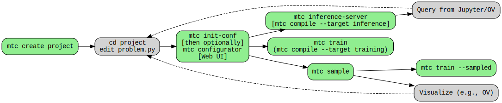

# Modulus Tool-Chain (MTC) (Alpha)

[See [A Conceptual Framework for PINNs](mtc/templates/docs/tutorial/ch0-pinn-conceptual-framework.md) for a more detailed project motivation]

The MTC suite of utilities aims to simplify work on Physics Informed Neural Networks and, eventually, Physics ML more broadly (it does not support neural operators currently). The goal is to provide sufficient support for the whole workflow in addition to a simplified API. More specifically

- Project management facilities
    - Creation, cloning / replicating / extending projects
    - Introspection and analysis
    - Training process control (start/stop, multi-stage training, history clearing, multi-gpu/node)
    - Using the trained models easily (Inference)
    - Simplified configuration initialization and validation (e.g. a Configurator GUI)

- Simplified API that clearly separates problem definition (`problem.py`) from training (solving the problem) and inference (using the solution)

At a high level, the toolchain is intended to work as the following diagram shows:


# Features

1. Basic 1D, 2D, 3D geometry and CSG operations and mesh geometry from STL files [[tutorial](mtc/templates/docs/tutorial/ch2-sample-subdomains.md)]
1. Sub domain creation with ability to parameterize PDEs [[tutorial](mtc/templates/docs/tutorial/ch1-hello-world.md)]
1. Pointwise constraints implemented in `Problem` API [[docs](mtc/templates/docs/problem.md)]
1. Automatic initialization of default configuration specific to problem
1. Compile targets: `training`, `inference`, `sampler`, `train-sampled`
1. Automatic rewriting of problem to equivalent formulation but only using first derivatives of neural networks ([tutorial](mtc/templates/docs/tutorial/ch6-semantic-analysis.md))
1. Configuration UI allows: detailed configuration and quick multi-stage training (e.g., transfer learning) [[tutorial](mtc/templates/docs/tutorial/ch5-multi-stage-training.md)]
1. Multi-gpu training; e.g., `mtc train --ngpus 2`


# Installation

Uses Modulus 22.07

For example, you may load a container and mount the root dir of this repo. Here is one way (run in the top level of this repo)

```
sudo docker run --gpus all --ipc=host --ulimit memlock=-1 --ulimit stack=67108864 -v `pwd`/:/tests -p 8888:8888 -it --rm nvcr.io/nvidia/modulus/modulus:22.07
```
The port forwarding is to enable a Jupyter lab server--the recommended way to interact with MTC. 

## Setup
If running inside a Modulus container for the first time
```
cd mpc
sh set-up-mtc-lab.sh
```

Set up your environment by running (in the top-level dir of this repo)
```bash
source set-up-env.sh
```
Then the Modulus Tool Chain becomes available. Run `mtc --help` for a list of commands, and `mtc [command] --help` for help on a specific command. 

Start the Jupyter Lab environment at the root of the repo with
```
mtc-lab --no-browser --NotebookApp.token='' --notebook-dir=/ --NotebookApp.allow_origin='*'
```
or simply
```
mtc-lab
```

# Using the toolchain

A [tutorial](mtc/templates/docs/tutorial/index.md) is available inside the environment (see setup above). 
1. Create a new project with `mtc create myproject` -- this creates and populates a directory called `myproject`
1. Inside the Jupyter Lab environment, navigate to  `myproject/docs/tutorial` and right-click on `index.md` to select "Open With"/"Markdown Preview"

The [`Problem API`](mtc/templates/docs/problem.md) is also documented.


# Release Notes

**v23.02**

1. First release (alpha)

# References

[1] Modulus Documentation: https://docs.nvidia.com/deeplearning/modulus/index.html

[2] Modulus container image from ngc.nvidia.com: https://catalog.ngc.nvidia.com/orgs/nvidia/teams/modulus/containers/modulus

**Pavel Dimitrov** pdimitrov@nvidia.com
