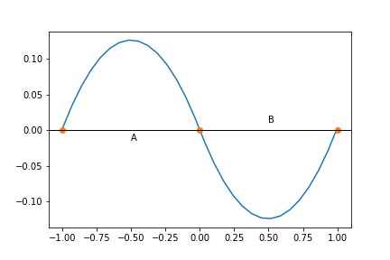
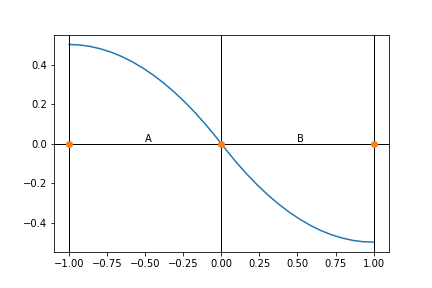
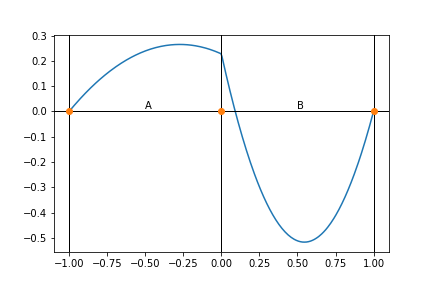
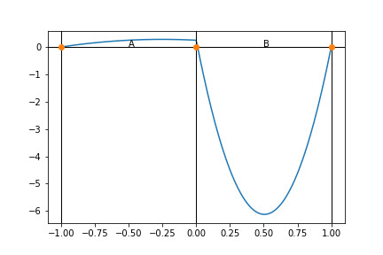
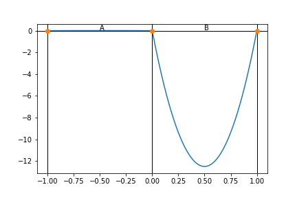
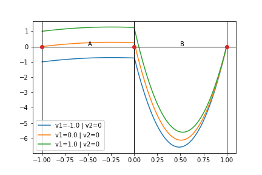

### Problem 1: Heat equation in 1D -- Heat Source

The tasks involve solving a heat equation problem in 1D but where two domains are involved. Domain $A=[-1,0]$ and domain $B=[0,1]$. The constraints on each domain are:
$$\begin{align}
u_{xx}(x) + 1 &=0,& \qquad x\in  A \\
u_{xx}(x) - 1 &=0,& \qquad x\in  B
\end{align}$$

**(a)** Using a single unknown function $u$ and a single neural network, find $u$ that satisfies these boundary conditions: 
$$u(-1) = u(0) = u(1) = 0$$

*Note:* a smooth approximation to a step function is useful here; e.g., modify a [sigmoid](https://en.wikipedia.org/wiki/Sigmoid_function) to describe the heat source/sink.

**(b)** Use two unknown functions $u_A$ and $u_B$ to solve the problem and then combine them into a single $u$ using a collection model (consult the Problem API docs)

**(c)** Solve (a) and (b) above for the following boundary conditions (Dirichlet at 0, Neumann at -1 and 1):
$$u(0)=0, u_{x}(-1)=u_{x}(1)=0$$

**Recommendation:** Create a separate project for each sub-problem; e.g., `p1a`, `p1b`, etc.

Here is a sample solution (for 1b and 1c)



### Problem 2: Heat equation in 1D -- Diffusivity

This problem explores variation in the diffusivity coefficients in addition to the heat source. The problem is now defined as:
$$\begin{align}
D_A u_{xx}(x) + 1   &=0,& \qquad x\in  A \\
D_B u_{xx}(x) - 1/2 &=0,& \qquad x\in  B \\ \\
u(-1) = u(1) &= 0&
\end{align}$$

**(a)** Solve for $D_A=1$ and $D_B=1/10$

**(b)** Solve for $D_A=1$ and $D_B=1/100$

**(c)** Solve for $D_A=10$ and $D_B=1/100$

**(d)** Solve the above using exact boundary conditions. To do this, make the output of the NNs be $v_A$ and $v_B$ and then define the following sub-models:
$$\begin{align}
u_A(x) = v_A(x) (x- (-1)) \\
u_B(x) = v_B(x) (x- (+1))
\end{align}$$

Now the constraints for the boundary conditions are no longer needed. How does this affect convergence speed?

Here is a sample solution (for 2a, 2b, 2c)




### Problem 3: Heat equation in 1D -- Parameterization

Take the previous problem and parameterize by the two endpoints so the boundary conditions become:
$$\begin{align}
u(-1) = V_1 \\
u(1) = V_2
\end{align}$$

So the (composite) uknown function is now $u(x, V_1, V_2)$ and depends on three variables instead of just one.

**(a)** Solve the problem using exact BC formulation you developed in 2d.

**(b)** Solve the problem using the BC formulation from 2b. Which version converges faster during training?

**(c)** Add a third parameter that defines $D_{ratio} = D_A/D_B$.

**(d)** Write an interactive notebook to explore the parameter space using `ipywidgets` and the "Classic Notebook" environment. Use `%matplotlib notebook` to enable interactive figures.


#### Visualization code
```python
x = np.linspace(-1,1, 300)
v1r= np.linspace(-1,1, 3)
v2r= np.linspace(-1,1, 3)
for vv1 in v1r:
    for vv2 in [0]:
        X,V1,V2 = np.meshgrid(x, np.array([vv1]), np.array([vv2]))
        l = f"v1={vv1} | v2={vv2}"
        plt.plot(x, infer1.infer(x=X, v1=V1, v2=V2, outputs=['ua', 'ub', 'f'])['f'], label=l)
plt.legend()
plt.axhline(0, c='k', lw=1)
plt.axvline(-1, c='k', lw=1)
plt.axvline(1, c='k', lw=1)
plt.axvline(0, c='k', lw=1)

plt.plot([-1,0,1], [0,0,0], 'o')
plt.text(-.5, 0.01, "A")
plt.text(.5, 0.01, "B")
plt.savefig("problem3a.png")
```


