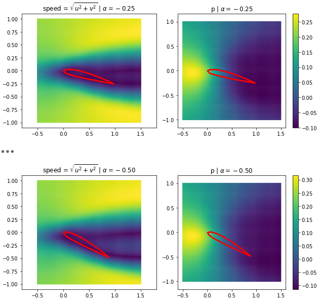
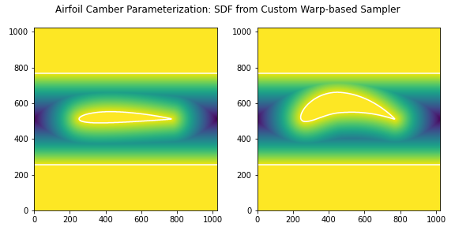
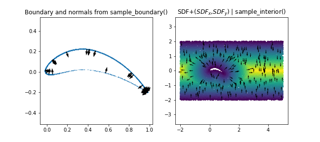
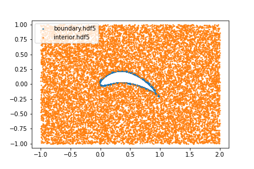

[Examples](../index.md)

# Airfoil
Contributors: Niki Andreas Loppi and Pavel Dimitrov

## Flow Parameterized by Rotation

This version uses the `Polygon` geometry primitive in Modulus and is parameterized only by rotation (angle of attack). The `problem.py` should look like [this](airfoil_rot_only_problem.py).



## Camber Parameterization



The sampler uses [`CustomAirfoilGeom.py`](CustomAirfoilGeom.py) and the new `problem.py` now looks like [this](airfoil-custom-geom-problem.py).



Code to generate this figure (note: may need to install Warp with `pip install warp-lang`)

```python
from modulus.geometry.parameterization import Parameterization, Parameter

f,axs=plt.subplots(1, 2, figsize=(9,4))

g=AirfoilInChannel((-.5,-1), (1.5,1))

p = Parameterization({Parameter("t"): float(0.20), 
                      Parameter("m"): float(0.20),
                      Parameter("rot"): float(-0.20)})

d = g.sample_boundary(20000, parameterization=p)
axs[0].scatter(d['x'][0:], d['y'][0:], s=.1)

nn=50
axs[0].quiver(d['x'][:nn], d['y'][:nn], d['normal_x'][:nn], d['normal_y'][:nn])
axs[0].axis("equal")
axs[0].set_title("Boundary and normals from sample_boundary()")

d = g.sample_interior(20000, parameterization=p)
plt.scatter(d['x'], d['y'], c=d['sdf'], s=5)

nn=500//2
plt.quiver(d['x'][:nn], d['y'][:nn], d['sdf__x'][:nn], d['sdf__y'][:nn])

plt.title("SDF+($SDF_x$,$SDF_y$) | sample_interior()")
e=plt.axis('equal')
f.suptitle("Custom Airfoil Geometry: GPU Sampler in Warp")
plt.tight_layout()
```

And here is the dummy `problem.py` that can be used to run `mtc sample` to see how this custom geometry may be set up:

```python
from cfg import *

[x, y, rot, m, t], [u] = p.add_neural_network(name="NN", inputs=["x", "y", "rot", "m", "t"], outputs=["u"])

import os
module_path = os.getcwd()
module_name = "CustomAirfoilGeom"
geo = p.CustomGeometry("geom", module_path, module_name, "AirfoilInChannel", (-1,-1), (2,1))

params = {rot: float(-.2), m: float(0.2), t: float(0.2)}

interior = p.add_interior_subdomain("interior",
                                    geom=geo,
                                    params=params)

boundary = p.add_boundary_subdomain("boundary",
                                    geom=geo,
                                    params=params)
    
p.add_constraint("int", enforce(equation=Eq(x,0), on_domain=interior))
p.add_constraint("bdry", enforce(equation=Eq(x,0), on_domain=boundary))
```

