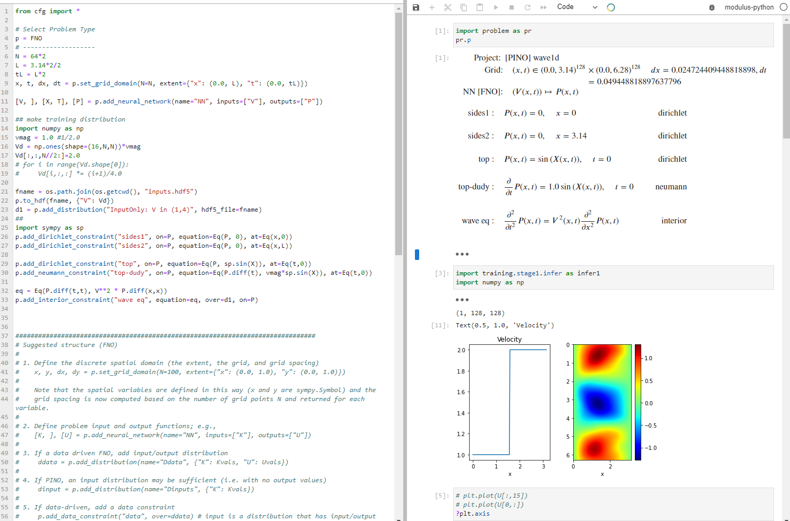

1D wave equation

```python
from cfg import *

# Select Problem Type
p = FNO
# -------------------
N = 64*2
L = 3.14*2/2
tL = L*2
x, t, dx, dt = p.set_grid_domain(N=N, extent={"x": (0.0, L), "t": (0.0, tL)})

[V, ], [X, T], [P] = p.add_neural_network(name="NN", inputs=["V", ], outputs=["P"])

## make training distribution
import numpy as np
vmag = 1.0 #1/2.0
Vd = np.ones(shape=(16,N,N))*vmag
Vd[:,:,N//2:]=2.0
# for i in range(Vd.shape[0]):
#     Vd[i,:,:] *= (i+1)/4.0

fname = os.path.join(os.getcwd(), "inputs.hdf5")
p.to_hdf(fname, {"V": Vd})
d1 = p.add_distribution("InputOnly: V in (1,4)", hdf5_file=fname)
##
import sympy as sp
p.add_dirichlet_constraint("sides1", on=P, equation=Eq(P, 0), at=Eq(x,0))
p.add_dirichlet_constraint("sides2", on=P, equation=Eq(P, 0), at=Eq(x,L))

p.add_dirichlet_constraint("top", on=P, equation=Eq(P, sp.sin(X)), at=Eq(t,0))
p.add_neumann_constraint("top-dudy", on=P, equation=Eq(P.diff(t), vmag*sp.sin(X)), at=Eq(t,0))

eq = Eq(P.diff(t,t), V**2 * P.diff(x,x))
p.add_interior_constraint("wave eq", equation=eq, over=d1, on=P)
```


