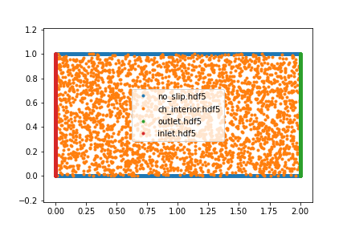
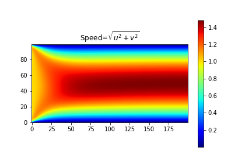
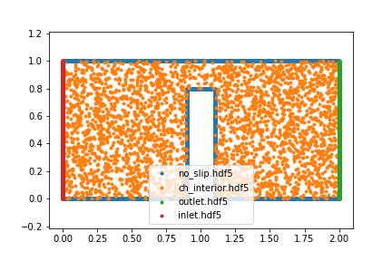
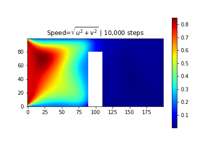
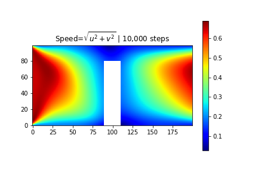
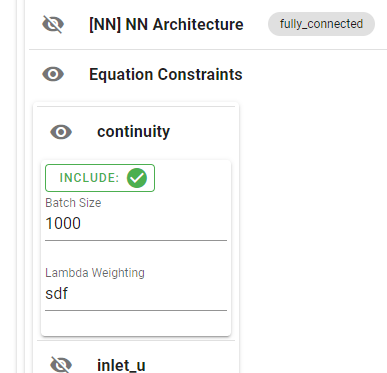
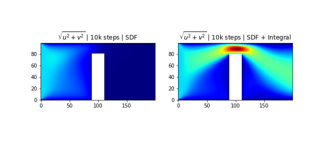
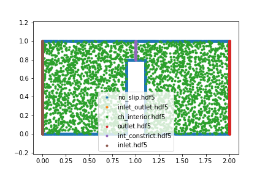
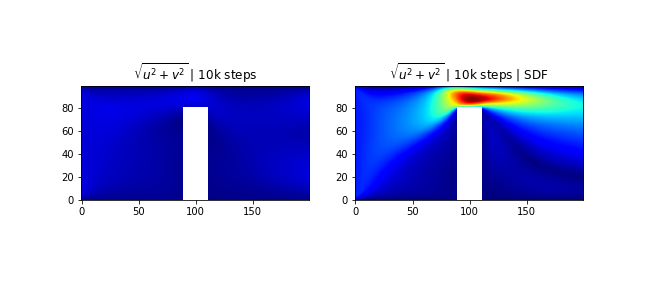
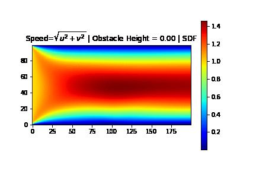

## Problem Set 2 -- CFD

### Recommended workflow for 2D geometries

It is important to e sure that the subdomains on which constraints are defined are correctly specified. For that purpose, we recommend displaying the sampled points from each subdomain prior to tuning the equations and (definitely!) prior to training. The following is the required workflow:

1. Define unknown functions
2. Define geometry
3. Define sub-domains
4. Add a constraint for each subdomain
5. Run `mtc init-conf`
6. Run `mtc sample` and visualize sampled points using code below

*Note:* Step 4, adding a constraint, is required because `mtc sample` will only sample subdomains that are actually needed. But a dummy equation (e.g., `Eq(x,0)`) is sufficient. Likewise, the unknown functions and their representations are do not be have to be completely figured out -- just one unknonw function, one NN and all the required variables will suffice.

Repeat steps 2-6 and rerun the following visualization code as needed:

```python
import numpy as np
import matplotlib.pyplot as plt
import h5py, os
dpath = 'training/stage1/samples/'
n=2000 # number of points from each sub-domain
dd={}
for fname in reversed(os.listdir(dpath)):
    with h5py.File(dpath+fname) as f:
        idx=np.random.choice(np.arange(f['x'].shape[0]), size=n)
        idx=np.sort(idx)
        plt.plot(f['x'][:][idx], f['y'][:][idx], '.', label=fname)
        dd[fname] = {k:f[k][:] for k in f.keys()}
        
plt.legend()
```

### Problem 1: Non-turbulent Navier-Stokes

Create a simple channel geometry and solve simplified steady-state NS problem.

**(a)** Apply the workflow above to set up the following sub-domains: inlet, outlet, interior, and no-slip (see figure).




**(b)** No update the constraints to represent the following PDE:
$$\begin{align}
\text{Continuity}&: & u_x + v_y  &=0& \quad (x,y)\in  interior   \\
\text{Momentum X}&: & u u_x + v u_y + p_x &= \nu (u_{xx} + u_{yy})& \quad (x,y)\in  interior  \\
\text{Momentum Y}&: & u v_x + v v_y + p_y &= \nu (v_{xx} + v_{yy})& \quad (x,y)\in  interior  \\
\end{align}$$

$$\begin{align}
\text{Inlet}&: & u=1, v=0  & \quad (x,y)\in  Inlet   \\
\text{Outlet}&: & p=0  & \quad (x,y)\in  Outlet   \\
\text{No slip}&: & u=0, v=0 & \quad (x,y)\in  NoSlip   \\
\end{align}$$

where $\nu=0.02$. Use the command line shortcut to increase the number of training steps: 

`mtc init-conf --max-steps 10000`

Here is what a solution looks like:



## Problem 2: Distance Field and Integral Constraints

**(a)** Apply the recommended workflow above to modify the geometry from the previous problem and introduce a constriction as shown below. *Note:* the `p.GeometryDifference` operation is useful here. For the cinstriction, the width is 0.2 and the height is 0.8.



**(b)** Solve the problem with the new geometry as above. Run for 1000 steps and inspect the result. Then run for 10000. Here is a sample:


**(c)** Add an integral constraint to ensure that mass flow through the inlet is the same as through the outlet. In other words, ensure that $\int_{\partial B} (n_x*u + n_y*v) dB=0$ where $\partial B$ is the boundary comprised only of the inlet and the outlet, and $n_x,n_y$ are the two compinents of the normal chosen such that $\int_{inlet} (n_x*u + n_y*v) dx dy =  \int_{outlet} (n_x*u + n_y*v) dx dy$.



**Note:** Observe that the addition of the integral constraint in improves on the original training in (b) by seemingly introducing a "pulling" mechanism at the outlet analogous to the "pushing" mechanism at the inlet. In other words, information about flow suddenly becomes available at the outlet as well.

**(d)** The previous attempt improves the convergence but we can do better. We could add an additional integral constraint in the middle, but there is a simpler modification that will improve the results and accelerate convergence. The intuition behind the modification comes from analyzing the optimization problem. 

    In the PINN framework, the equation-based constraints are ultimately turned into an objective function which is used to guide the weights on the representation of the unknown functions (see Chapter 0 of the tutorial). So, in this problem the no-slip boundary conditions require the $u$ and $v$ components to become zero, and that information must propagate (we use a gradient-based method) torward the channel interior and be compatible with the PDE constraints given by continuity and momentum equations. Our first two attempts -- (b) and (c) -- treat each interior point the same as any other interior point. But this observation suggests that the points near the no-slip boundaries should probably be less important in the early optimzation steps to allow information from the boundaries to dominate.

    Modulus has a mechanism to adjust the training process and take advantage of this observation: apply a weight to each interior point that is proportional to the distance to the boundary--for each point in an interior subdomain Modulus also computes a Signed Distance, which taken over all points forms a Signed Distance Field (sdf). This way, points closer to the boundary influence the updates less than points far from the boundary.

Use the Configurator GUI to navigate to the "Equation Constraints" group and then set the "Lambda Weighting" to "sdf" for each of the NS constraints: `continuity`, `momentum_x`, and `momentum_y`.




Use the Configurator tool to set up two stages: **stage1** that runs the problem with SDF enabled but without the Integral Constraint as in (b); and **stage2** that runs the problem with both SDF and integral Constraint enabled as in (c). Then plot the results after 10000 steps of training.




**Note:** The addition of SDF weightig does improve the results compared to the solution in (b), but the SDF together with the right integral constraint have a much more drastic effect. Observe that the addition of the integral constraint in (c) improves on the original training by seemingly introducing a "pulling" mechanism at the outlet analogous to the "pushing" mechanism at the inlet. In other words, information about flow suddenly becomes available at the outlet as well.

The following code was used to generate the figure above (note `infer1` comes from stage1 and `infer2` comes from stage2)

```python
f, axs = plt.subplots(1,2, figsize=(9,4))

ax = axs[0]

X,Y = np.meshgrid(np.linspace(0,2, 2*100), np.linspace(0,1, 100))
r=infer1.infer(x=X, y=Y)
u = r['u'].reshape(X.shape)
v = r['v'].reshape(X.shape)
sel = ( (X>.9)&(X<1.1)&(Y<.8) )
c=np.sqrt(u*u+v*v)
c[sel]=np.nan
c_no_int = c

r=infer2.infer(x=X, y=Y)
u = r['u'].reshape(X.shape)
v = r['v'].reshape(X.shape)
sel = ( (X>.9)&(X<1.1)&(Y<.8) )
c=np.sqrt(u*u+v*v)
c[sel]=np.nan
c_int = c


im=ax.imshow(c_no_int, cmap="jet")
ax.invert_yaxis()
nsteps = 10000
ax.set_title("$\sqrt{u^2+v^2}$ | " + f"{nsteps//1000:,}k steps | SDF")

for im in ax.get_images():
    im.set_clim(0,np.max(c_int[~sel]))


ax=axs[1]
im=ax.imshow(c_int, cmap="jet")
ax.invert_yaxis()
nsteps = 10000
ax.set_title("$\sqrt{u^2+v^2}$ | " + f"{nsteps//1000:,}k steps | SDF + Integral")

```

**(e)** Now introduce an additional integral plane at the constriction (x=1) to compare the effectiveness of this approach vs SDF. Update the geometry to introduce another intergal plane in the middle as shown below (could use a rectangle restricted to the existing constricted channel). Add the integral constraint as in part (c) in addition to the inlet/outlet mass balance.




The additional integral constraint improves the results even further. But it works best when the SDF weighting is enabled.



## Problem 3: Geometry Parameterization

Extend the solution from Problem 2 by introducing an obstacle height `oh` parameter.

