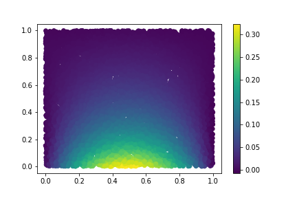
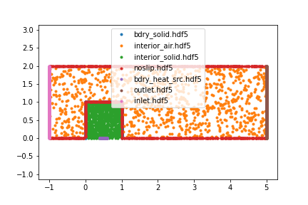
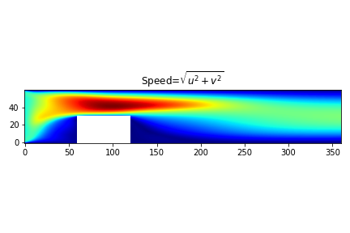
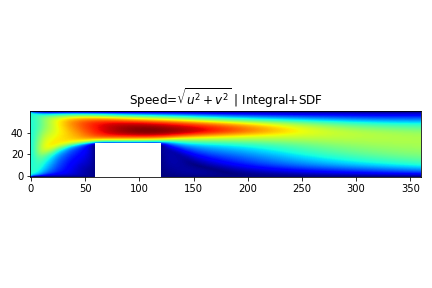
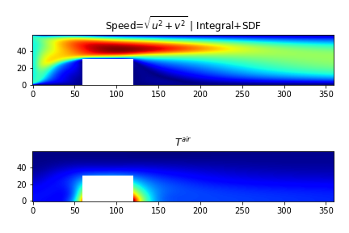
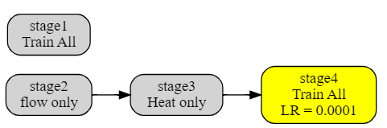
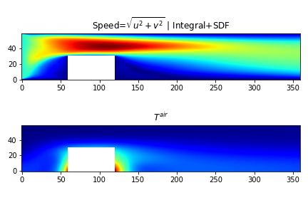

## Problem Set 3 -- Conjugate Heat Transfer (CHT)

In this problems set we will solve a simplified Conjugate HEat Transfer problem in 2D. Once it is all done, we will have a heat source under a solid heat sink, and air flow through the heat sink that will allow the system's temperature to stabilize. This is a steady-state problem.

### Problem 1 -- Heat

**(a)** Using the workflow from the Set 2, set up the following sub-domains

Note that the solid boundary does not include the bottom (i.e. only $y>0$). The heat source is at $y=0$ and $Abs(x-0.5)<0.1$ (the `sympy` syntax for these criteria is `Eq(y,0) & Abs(x-0.5)<0.1`.

**(b)** Set up this heat problem and solve it.
$$\begin{align}
\text{Diffusion}&: & 0.0625 (T_{xx} + T_{yy})  &=0& \quad (x,y)\in  interior   \\
\text{Boundary}&: & T  &= 0& \quad (x,y)\in  bdry_{solid}  \\
\text{Heat Source}&: & n_y T_y &= 1 & \quad (x,y)\in  bdry_{heat src}  \\
\end{align}$$

The result should look like this (after 1000 steps):

### Problem 2 -- Air Flow (no heat)

**(a)** Extend the subdomains from Problem 1 to include a channel through which air will flow and which includes the solid. The subdomains should look like this (note that some of the subdomains from Problem 1 overlap with the new `no-slip` subdomain).

**(b)** Set up and solve the following NS problem.
$$\begin{align}
\text{Continuity}&: & u_x + v_y  &=0& \quad (x,y)\in  interior   \\
\text{Momentum X}&: & u u_x + v u_y + p_x &= \nu (u_{xx} + u_{yy})& \quad (x,y)\in  interior  \\
\text{Momentum Y}&: & u v_x + v v_y + p_y &= \nu (v_{xx} + v_{yy})& \quad (x,y)\in  interior  \\
\end{align}$$

$$\begin{align}
\text{Inlet}&: & u=1, v=0  & \quad (x,y)\in  Inlet   \\
\text{Outlet}&: & p=0  & \quad (x,y)\in  Outlet   \\
\text{No slip}&: & u=0, v=0 & \quad (x,y)\in  NoSlip   \\
\end{align}$$

**Note** Use a different neural network for the flow network. This will, in effect, set up two non-coupled problems and they will solve simultaneously.

Here is what the solution looks like after 10,000 steps:

**(c)** Add integral constraints to ensure air mass balance at the inlet/outlet. A new subdomain `inlet_outlet` is needed here as well as the mass balance integral equation. Also, ensure that SDF weighting is enabled to speed up convergence. (Refer to Set 2 Problem 2)

### Problem 3 -- Conjugate Heat Transfer

**(a)** Add Advection and heat transfer in the air. 

- Remove the $T^{solid}=0$ BC from Problem 1b

- Add a third neural network to represent temperature in the air $T^{air}$

- Heat is generated at the bottom of the heat sink and it is transmitted to the air at the `bdry_solid` interface. This requires the following two constraints to be applied there:
    1. Temperature compatibility: $T^{solid} = T^{air}$
    2. Flux compatibility: $5 (n_x*T^{solid}_x+n_y*T^{solid}_y)=n_x*T^{air}_x+n_y*T^{air}_y$

- We will assume that the channel through which air flows is insulating and no heat transfer occurs. In other words zero flux at the channel walls: $n_x T^{air}_x+n_y T^{air}_y=0$ (note that $n_x=0$ at the channel wall). Add a `channel_wall` subdomain that and apply this constraint to it.

- Finally, to model heat transfer in the air, we will use the following advection diffusion constraint:

$$u T^{air}_x + v T^{air}_y = 0.02 (T^{air}_{xx} + T^{air}_{yy})$$

Train the new problem for 10000 steps (set SDF weighting for the continuity and momentum constraints). This is what the solution looks like:

**(b)** Train in multiple stages:

- Stage 1: only train the flow network for 10000 steps (set SDF weighting for the continuity and momentum constraints).

- Stage 2: create it as a child stage of Stage 1 and only train the heat part (for both air and solid) for 10000 steps.

- Stage 3: create as child stage of Stage 2, reduce the learning rate by one order of magnitude to 0.0001, and train everything for another 10000 steps.

The stages graph might look like this:

Results after Stage 2:

