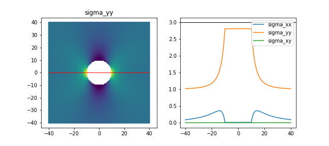
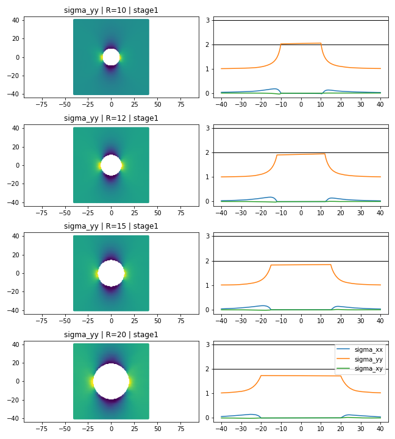

[PINN Examples](../index.md)

# Structural Analysis

Contributors: Praveen Nakshatrala (NVIDIA) and Pavel Dimitrov (NVIDIA)

---

## Stress Concentration in 2D

Example adapted from [Stress Concentrations at Holes](https://www.fracturemechanics.org/hole.html) [1] where the theoretical $\sigma_{yy}=3$ at the boundary of the hole may be used to judge how well our implementation works. Result shown in the figure below. Note that the PINN was able to get very close without any special treatment of the sampling points near the whole.

To reproduce, the `problem.py` definition should like like [this](struct_2d_problem.py).

## Moving to 3D

The exact same problem may be formulated in 3D. The `problem.py` may look like [this](struct_3d_problem.py). In addition the radius of the sphere here is a parameter varying between 10 and 20.

## References

[1] "Stress Concentrations at Holes" https://www.fracturemechanics.org/hole.html