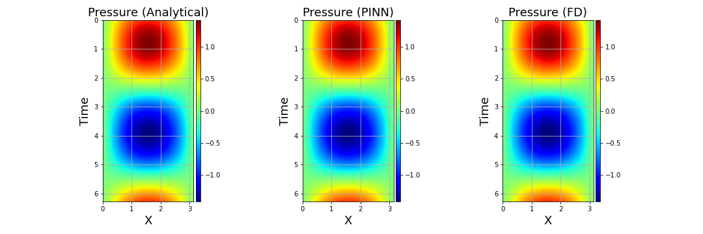
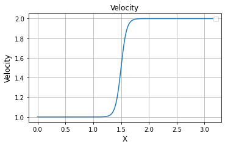
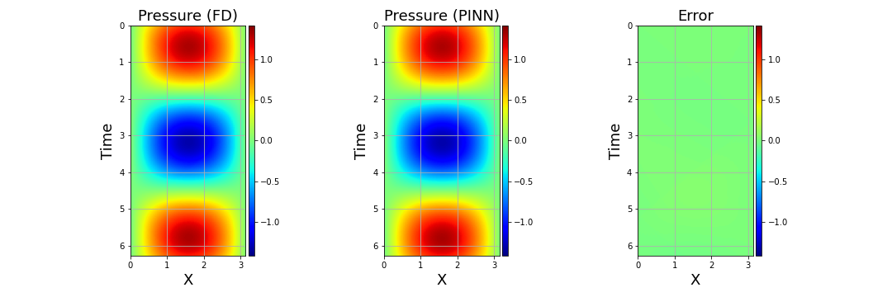
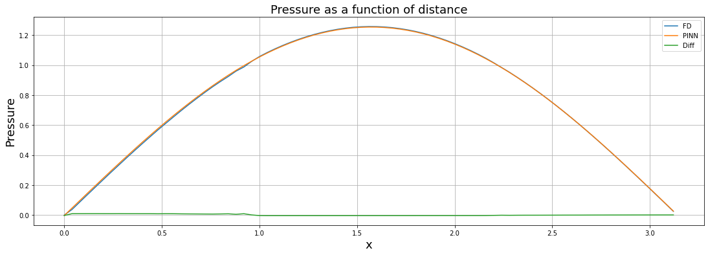
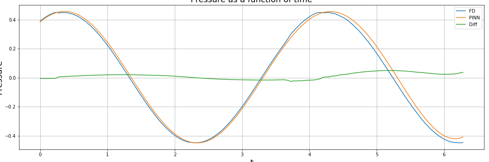
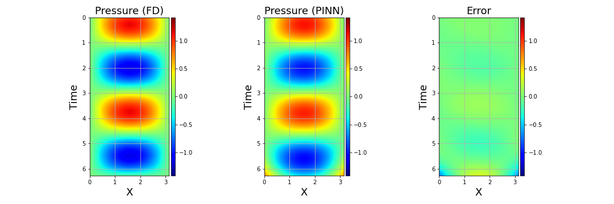
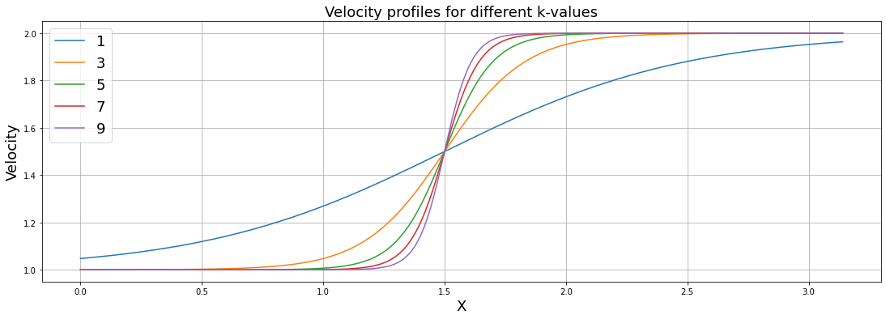
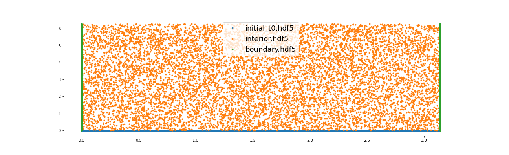
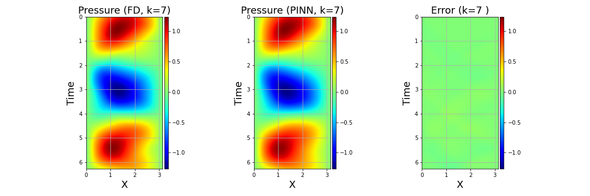
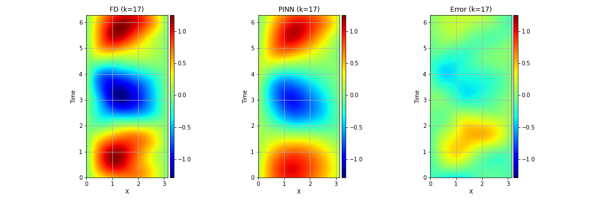

[Back to outline](../index.md)

# 1D Wave-Equation Forward Modeling (Pressure prediction)

## Description
The goal of this study is to use MTC (and PINNs) to predict the seismic pressure wavefield obeying a partial difference equation (PDE) in a one-dimensional domain of interest given some initial/boundary conditions. The PDE statisfied by the pressure field in a 1D, acoustic, isotropic, constant-density medium is given by 

$$\frac{1}{v(x)^2}\frac{\partial^2 p(x,t)}{\partial t^2} - \frac{\partial^2 p(x,t)}{\partial x^2} = 0,$$ 

where $p$ is the pressure field (in Pa), $x \in [0,L]$ is the position (in km), $t \in [0, 2L]$ is time (in sec), and $L$ is the length of the domain. We use two initial conditions,
1. $p(x,t=0) = sin(x)$ 
2. $\frac{\partial p(x,t)}{\partial t}|_{t=0} = sin(x),$ 

for all $x \in [0, L]$. Finally, we impose one boundary condition  
    $$p(x,t) = 0,$$ 
for all $t$ and $x=0$ or $x=L$.

We tackle four different scenarios to illustrate how flexible and adaptable MTC is for such problems. For each case, we briefly describe the problem setup, and we provide:
- A `problem_solution.py` file (the solution) 
- A Jupyter Notebook `*.iypnb` describing a step-by-step workflow to train, visualize and quality-control (QC) the results.

## Getting started
- Create a new MTC project (e.g., `mtc create wave1d-constant-velocity`), and follow the instructions on the **Jupyter Notebook** corresponding to the scenario of your choice.
- The notebooks all have a similar structure:
    - In the first stage, you will compute the finite-difference (FD) solution (assumed to be the ideal solution)
    - In the second stage you will have to configure `problem.py`, train the PINN, and visualize your results by comparing them with the FD solution. 
    - The training hyper-parameters can be adjusted by launching the `configurator.py`, as described in [Chapter 5](../../../mtc/templates/docs/tutorial/ch5-multi-stage-training.md) of our [MTC tutorial](../../../mtc/templates/docs/tutorial/index.md). 

## Scenario 1: Constant velocity medium
- Open the notebook [`we-fwd-1d-cv-results.ipynb`](notebooks/we-fwd-1d-cv-results.ipynb) and follow the instructions
- Create a neural net $N$ which takes into input the position $x$ and the time $t$. The output is the acoustic pressure $p(x,t)$ at this location/time
- Start with the initial/boundary conditions specified in the notebook
- For the training stage, add four constraints:
    1. Two initial conditions on the pressure field itself and on its time derivative
    2. One boundary condition
    3. One constraint enforcing the pressure field to satisfy the PDE inside the 1D modeling domain 
- Compare the predicted pressure obtained by the **PINN**  with the **analytical solution** and the numercial solution obtained using a **finite-difference (FD)** scheme 
- Your solution should look similar to this (obtained after 10,000 iterations with default parameters on the configurator file): 

- The solution can be found in the file [`we-fwd-1d-cv-problem.py`](solutions/we-fwd-1d-cv-problem.py)

## Scenario 2: 2-layer velocity medium
- In this scenario, the velocity is now non-constant. Consider a 2-layer model whose profile is shown in the figure below (horizontal and vertical axes represent distance and velocity, respectively): 

- Open the notebook called [`we-fwd-1d-ncv-results.ipynb`](notebooks/we-fwd-1d-ncv-results.ipynb) and follow the instructions. 
- Use the same set of hyper parameters for training as in the previous section (10,000 iterations, default parameters)
- Compare the **PINN solution** with the numercial solution obtained using a **finite-difference (FD)** scheme. Your solution should look similar to this (obtained after 10,000 iterations):

 

- The solution can be found in the file [`we-fwd-1d-ncv-problem.py`](solutions/we-fwd-1d-cv-problem.py)

## Scenario 3: Constant velocity medium where velocity is also an input to the NN
- In this scenario, the velocity is assumed to be constant but it is an input to the NN used to predict the seismic pressure field within the domain of interest. In other words, the NN achieves the following mapping, $$N: x,t,v \mapsto p(x,t,v).$$
- Open the notebook called [`we-fwd-1d-vel-results.ipynb`](notebooks/we-fwd-1d-vel-results.ipynb) and follow the instructions. 
- Train the NN for $v$ ranging from 1 km/s to 1.5 km/s for 10,000 iterations with the defaults parameters on the configurator file `configurator.py`. 
    - For a velocity value within the range used for training (e.g., $v=1.2$ km/s), your results should be similar to:

    

    
    

<!-- - As expected, for a velocity value outside of the range used for training ($v=1.8$ km/s) the results become less accurate:

         -->
- Our proposed solution is shown in [`we-fwd-1d-vel-problem.py`](solutions/we-fwd-1d-vel-problem.py) 

## Scenario 4: 2-layer velocity medium parametrized by one parameter, which is an input to the NN
- Consider a 2-layer velocity model parametrized by a single parameter $k$ corresponding to the sharpness of the interface. For simplicity, the velocity values in both layers are known.

    

- We train a NN whose mapping is given by $$N: x,t,k \mapsto p(x,t,k).$$
- Open [`we-fwd-1d-vel-k-results.ipynb`](notebooks/we-fwd-1d-vel-k-results.ipynb) and conduct a similar analysis as in the previous question where the input of the NN also includes the parameter $k$, and train the NN for a range of $k$-values (e.g., 1 to 10) with 10,000 iterations using the default values from the configurator file. 

- The figure below displays a subset of the sample points for each domain used for training the PINN: 

    

- For $k=9$, the solution is accurate:  
    

- As we predict the wavefield for $k$-values outside of the training range, the accuracy decreases. This is just to show that one should **never extrapolate** when using PINNs:

    - For $k=13$:   

  

    - For $k=17$:  

   

- Finally, our proposed solution is shown in [`we-fwd-1d-vel-k-problem.py`](solutions/we-fwd-1d-vel-k-problem.py) 

