[Back to outline](../index.md)

# 1D Wave-Equation Inversion

## Goals
In this study, you will use MTC to achieve two goals :
1. **Forward modeling**: predict the seismic pressure wavefield obeying a partial difference equation (PDE) in a one-dimensional domain of interest given some initial/boundary conditions 
2. **Inversion**: use some recorded pressure data to recover the "true" velocity model that gave rise to that dataset 

## Description
- The PDE, initial and boundary conditions we use are the same as in the previous set of examples:

$$\frac{1}{v(x)^2}\frac{\partial^2 p(x,t)}{\partial t^2} - \frac{\partial^2 p(x,t)}{\partial x^2} = 0,$$ 

where $p$ is the pressure field (in Pa), $x \in [0,L]$ is the position (in km), $t \in [0, 2L]$ is time (in sec), and $L$ is the length of the domain. We use two initial conditions,
1. $p(x,t=0) = sin(x)$ 
2. $\frac{\partial p(x,t)}{\partial t}|_{t=0} = sin(x),$ 

for all $x \in [0, L]$. Finally, we impose one boundary condition  
    $$p(x,t) = 0,$$ 
for all $t$ and $x=0$ or $x=L$. 
- A seismic wavefield is generated using a FD scheme and recorded at some predefined locations. We use these recordings as additional constraints when training the PINN.  
- We tackle four different scenarios to illustrate how flexible and adaptable MTC is for such problems. For each case, we briefly describe the problem setup, and we provide:
    - A `problem_solution.py` file (the solution) 
    - A Jupyter Notebook `*.iypnb` describing a step-by-step workflow to train, visualize and quality-control (QC) the results.

## Getting started
- Create a new MTC project (e.g., `mtc create wave1d-innersion-scenario1`), and follow the instructions on the **Jupyter notebooks** corresponding to the scenario of your choice.
- The notebooks all have a similar structure:
    - First stage: compute the finite-difference (FD) solution (assumed to be the ideal solution)
    - Second stage: extract a subset of the wavefield that will be used as training data for the training phase of the PINN
    - Third stage: configure `problem.py`, train the PINN, and visualize your results by comparing them with the FD solution
    - The training hyper-parameters can be adjusted by launching the `configurator.py`, as described in [Chapter 5](../../../mtc/templates/docs/tutorial/ch5-multi-stage-training.md) of our [MTC tutorial](../../../mtc/templates/docs/tutorial/index.md). 

## Scenario 1: Constant velocity medium
- Open the notebook [`we-inv-1d-vel-results.ipynb`](notebooks/we-inv-1d-vel-results.ipynb) and follow the instructions
- In `problem.py`, 
    - create a neural net $N_1$ which takes into input the position $x$ and the time $t$. The output is the acoustic pressure $p(x,t)$ at this location/time
    - Create a neural net $N_2$ which takes into input the position $x$. The output is the velocity value $v(x)$ at this location
- Compute the FD solution using the same initial/boundary conditions as in the previous examples. Extract a subset of the data into a `.hdf5` file (the training data) as shown in the notebook. Try to vary the number of data points used for training to assess its impact on the results' accuracy. 
- For the training stage, add five constraints:
    - Two initial conditions on the pressure field itself and on its time derivative
    - One boundary condition
    - One constraint enforcing the pressure field to satisfy the wave-equation inside the 1D modeling domain 
    - Add the constraint on the training data from the recorded seismogram. To load the data file, look into [`we-inv-1d-vel-problem.py`](solutions/we-inv-1d-vel-problem.py)
- Compare the **PINN solution** with the numercial solution obtained using a FD scheme. Your solution should look similar to this (obtained after 10,000 iterations with default parameters on the configurator file): 

    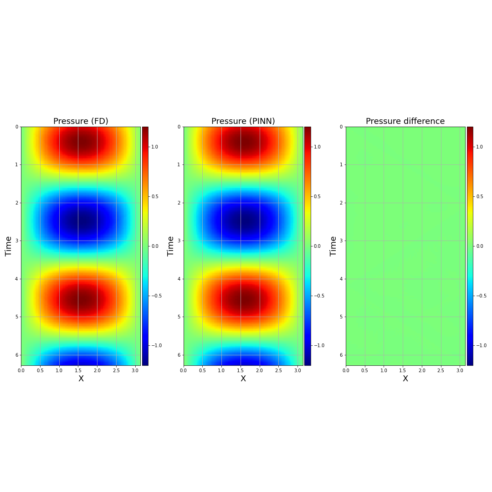
    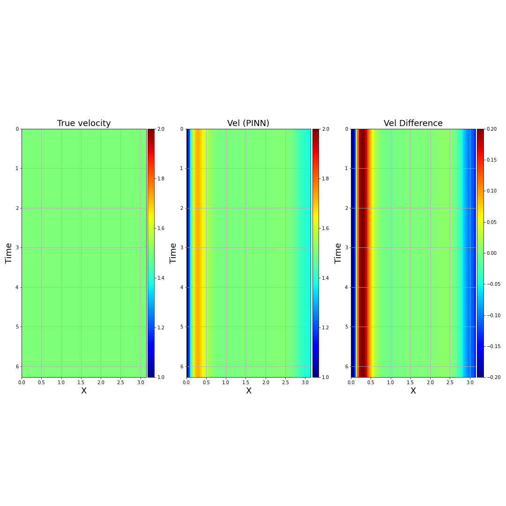

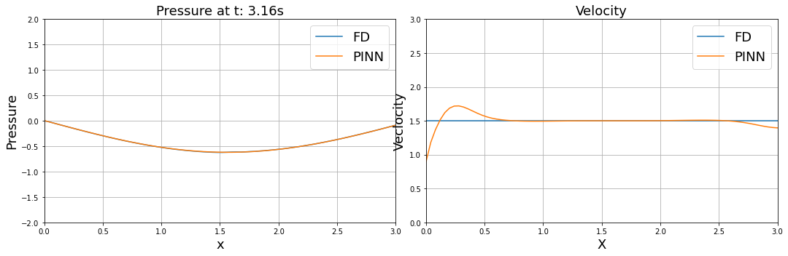

In the figure above, the first row shows the pressure field obtained with the FD scheme (first column), the predicted pressure field from the PINN (second column), and the difference (third column). Analogously, the second row shows the true velocity, inverted velocity, and difference.   

- As you can see, while the predicted wavefield is accurate, the recovered velocity suffers from edge artifacts. To mitigate this issue, it is possible to incorporate additional constraints when training the NN by minimizing the norm of the spatial derivative of the velocity value inside the domain. After adding such constraint and re-training the PINN, you should be able to get:

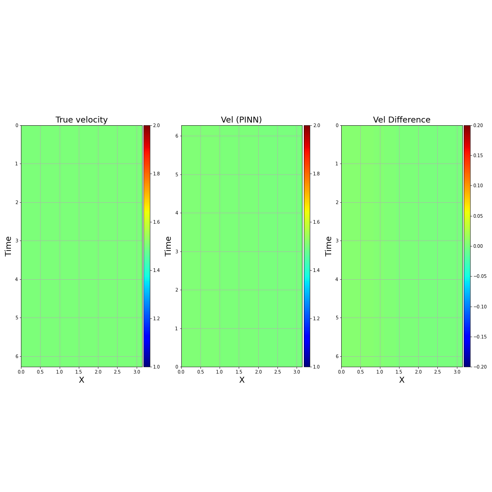

- By adding the constraint to minimize the norm of the spatial derivative of $v$, the recoverd velocity is accurate, even in the vicinity of the edges. 
- We provide our solution in [``we-inv-1d-vel-deriv-problem.py``](solutions/we-inv-1d-vel-deriv-problem.py)

## Scenario 2: 2-layer velocity model
- Conduct a similar analysis for a 2-layer model. 
- Open the notebook [`we-inv-1d-vel-2layers-results.ipynb`](notebooks/we-inv-1d-vel-2layers-results.ipynb) and follow the instructions.
- Without any spatial derivative constraints on the velocity model, the predicted pressure/velocity from the PINN is shown in the figures below:

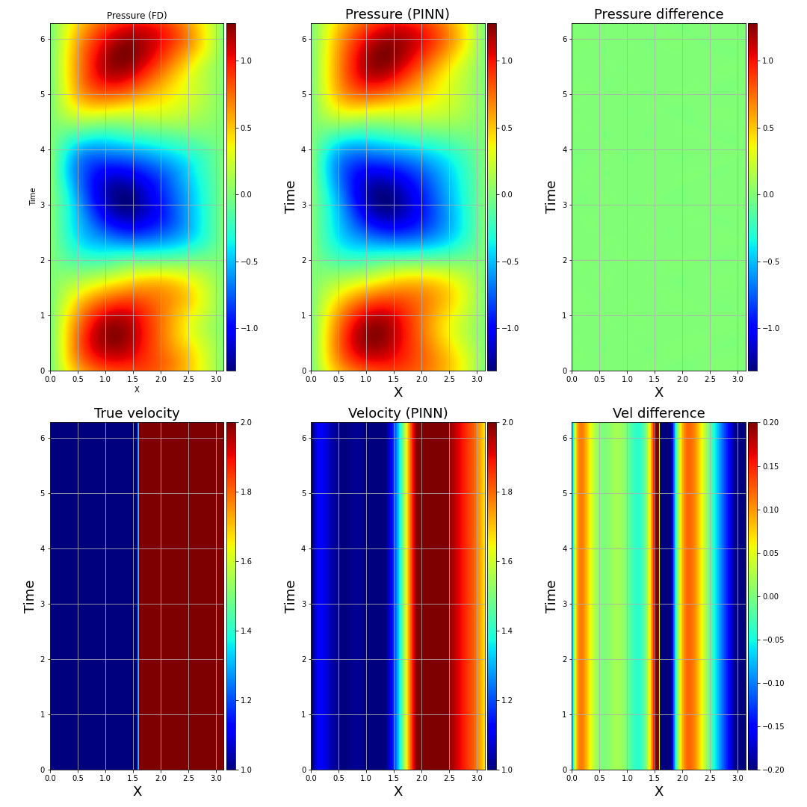
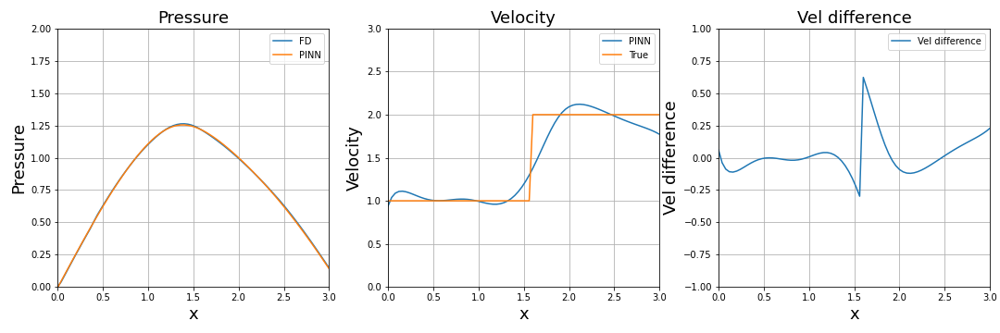

- By adding the spatial derivative constraint, the results' quality improve (open the notebook [`we-inv-1d-vel-2layers-deriv-results.ipynb`](notebooks/we-inv-1d-vel-2layers-deriv-results.ipynb) for more details) and follow the instructions.):

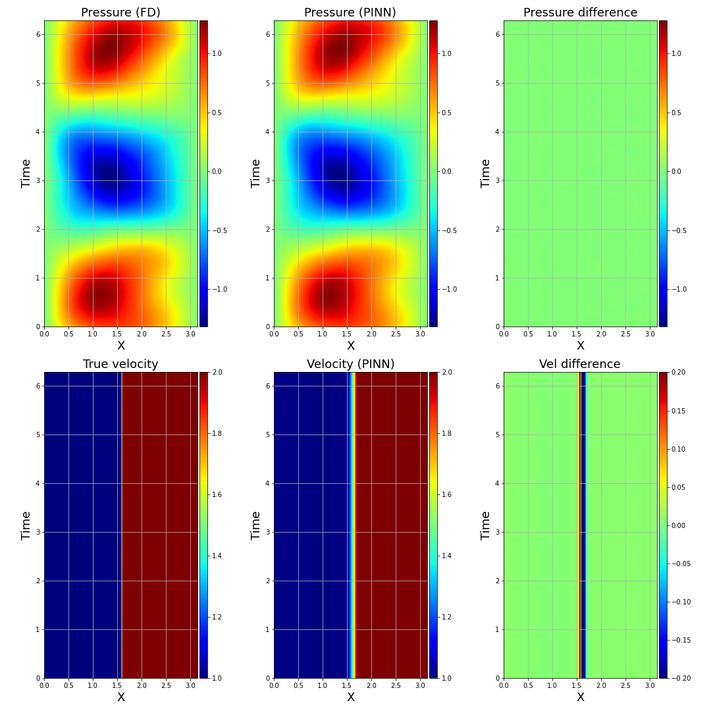
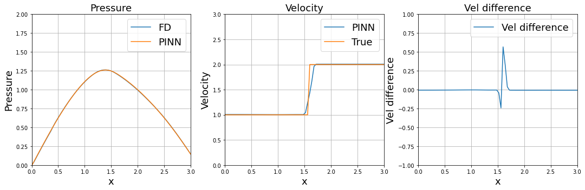

- We provide our solution in [``we-inv-1d-vel-2layers-deriv-problem.py``](solutions/we-inv-1d-vel-2layers-deriv-problem.py)

## Scenario 3: 3-layer velocity model
- Conduct a similar analysis for a 3-layer model. 
- Open the notebook [`we-inv-1d-vel-3layers-deriv-results.ipynb`](notebooks/we-inv-1d-vel-3layers-deriv-results.ipynb) and follow the instructions.
- The 2D panels of the predicted pressure and inverted velocity model using spatial-derivative constraints is shown in the figure below:
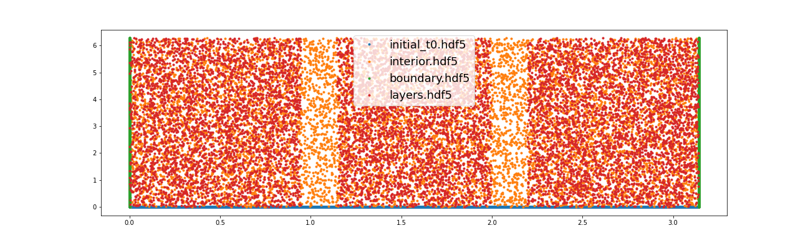
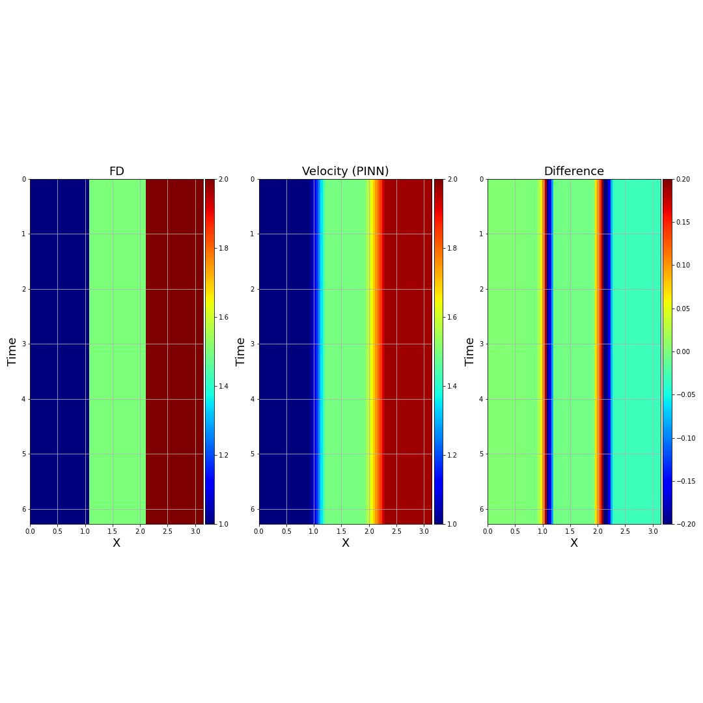

- The 1D profiles of the pressure prediction at $t=0$ s (left panel), the inverted velocity (middle panel), and velocity error (right panel) are shown: 

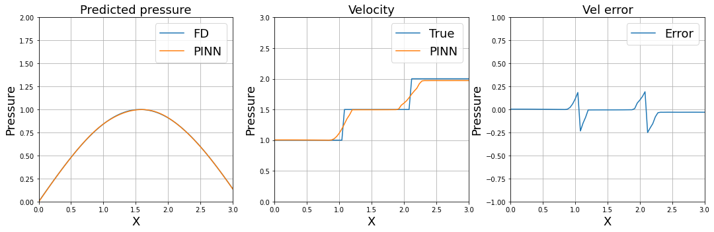

- We provide our solution in [``we-inv-1d-vel-3layers-deriv-problem.py``](solutions/we-inv-1d-vel-3layers-deriv-problem.py)

## Scenario 4: 4-layer velocity model
- Conduct a similar analysis for a 4-layer model. 
- Open the notebook [`we-inv-1d-vel-4layers-results.ipynb`](notebooks/we-inv-1d-vel-4layers-deriv-results.ipynb) and follow the instructions.
- The 2D panels of the predicted pressure and inverted velocity model using spatial-derivative constraints is shown in the figure below:

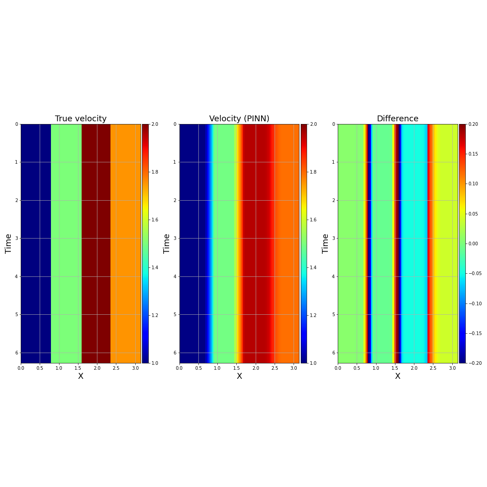

- The 1D profiles of the pressure prediction at $t=0$ s (left panel), the inverted velocity (middle panel), and velocity error (right panel) are shown: 
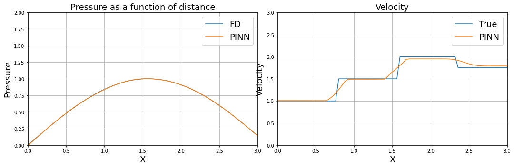

- We provide our solution in [``we-inv-1d-vel-4layers-deriv-problem.py``](solutions/we-inv-1d-vel-4layers-deriv-problem.py)