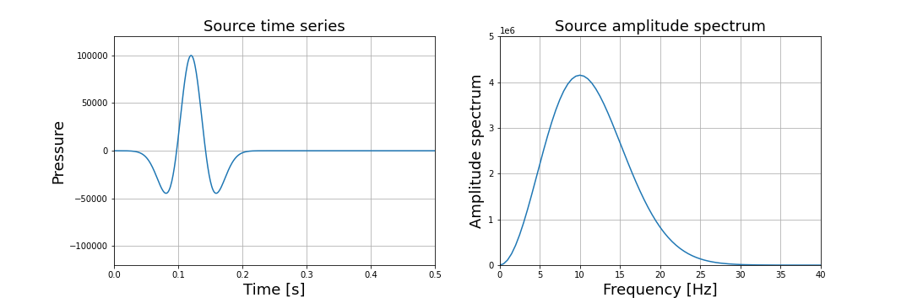
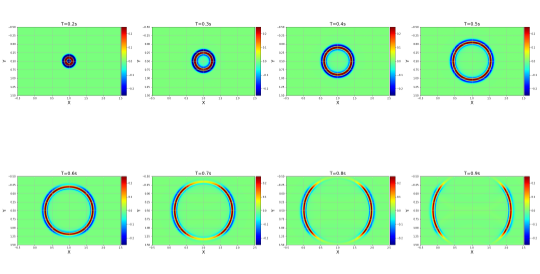
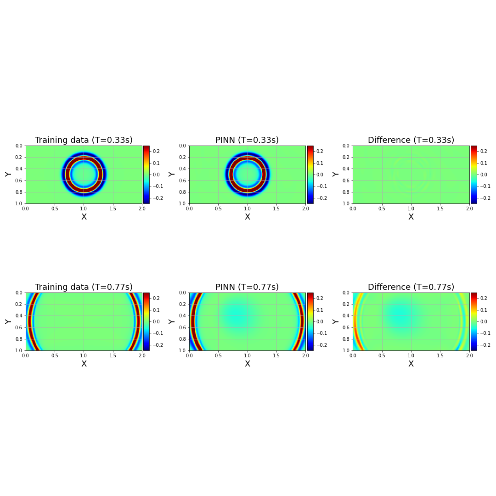

[Back to outline](../index.md)

# 2D Wave-Equation Forward Modeling

## Description
The goal of this study is to use MTC (and PINNs) to predict the seismic pressure wavefield obeying a partial difference equation (PDE) in a one-dimensional domain of interest given some initial/boundary conditions. The PDE statisfied by the pressure field in a 2D, acoustic, isotropic, constant-density medium is given by 

$$\frac{1}{v(x,y)^2}\frac{\partial^2 p(x,y,t)}{\partial t^2} - \Delta p(x,y,t) = s(x,y,t),$$ 

where $p$ is the pressure field (in Pa), $x \in [0,2]$, $y \in [0,2]$ is the position (in km), $t \in [0, 1]$ is time (in sec), and $s$ is a point source located at $x_s = 1$ km, $y_s = 0.5 $ km. $s$ can be expressed by 

$$s(x,y,t) = \delta(x-x_s) \; \delta(y-y_s) \; w(t),$$

where $w$ is a Ricker wavelet with a 10 Hz dominant frequency, whose time signature and frequency content is shown in the figure below:

We use two initial conditions,
1. $p(x,y,t=0) = 0$ 
2. $\frac{\partial p(x,y,t)}{\partial t}|_{t=0} = 0,$ 

for all $x \in [0, 2]$. Finally, we impose one boundary condition  
    $$p(x,y,t) = 0,$$ 
for all $t$ and $x=0$ or $x=2$.

In each example proposed in this section, we briefly describe the problem setup, and we provide:
- A `problem_solution.py` file (the solution) 
- A Jupyter Notebook `*.iypnb` describing a step-by-step workflow to train, visualize and quality-control (QC) the results.

## Getting started
- Create a new MTC project (e.g., `mtc create wave2d-constant-velocity`), and follow the instructions on the **Jupyter Notebook** corresponding to the scenario of your choice.
- The notebooks all have a similar structure:
    - In the first stage, you will compute the finite-difference (FD) solution (assumed to be the ideal solution)
    - In the second stage you will have to configure `problem.py`, train the PINN, and visualize your results by comparing them with the FD solution. 
    - The training hyper-parameters can be adjusted by launching the `configurator.py`, as described in [Chapter 5](../../../mtc/templates/docs/tutorial/ch5-multi-stage-training.md) of our [MTC tutorial](../../../mtc/templates/docs/tutorial/index.md). 

## Scenario 1: Simple data-fitting experiment
- Open the notebook [`we-fwd-2d-cv-snapshots-results.ipynb`](notebooks/we-fwd-2d-cv-snapshots-results.ipynb) and follow the instructions. 

- The figure below shows eight snapshots ranging from 0.2 s to 0.9 s extracted from the FD solution (the panels include the additional padding used for absorbing boundary):

- For the training data, we extract 10 wavefield snapshots ranging from $t=0.2 $ s to $t=0.6$ s, sampled every 0.4 s. 

- We train a NN mapping $x,y,t$ to a pressure prediction $p(x,y,t)$ by only using the recorded data as constraint. We conduct 100,000 iterations using a learning rate of $3.0 \times 10^{-3}$, and NN composed of 12 fully connected layers of 512 hidden units each. 

- The two figures below shows the FD solution, the PINN prediction, and the  difference for $t= 0.33$ s (first row), and for $t=0.77$ s (second row):

