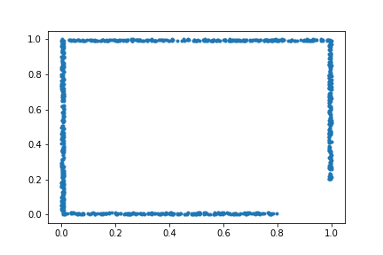
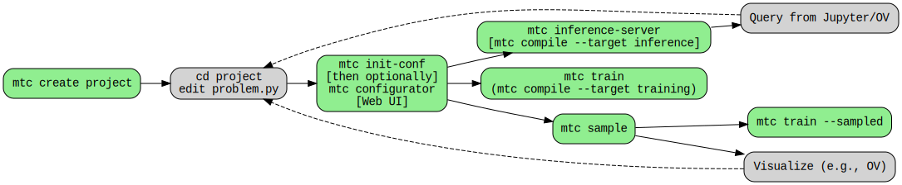

# Elements of a `problem.py` -- for PINNs

A problem is defined using the `p` object imported from the `cfg.py` local module. The object provides facilities to:

1. Define models with "unknown functions" -- the neural networks
1. Define the domain geometries
1. Build sub-domains using the various geometries
1. Define sub-models that can be used to both define constraints and for inference. (the main goal for solving the problem)
1. Define equation-based constraints (using the sub-models)
1. Define data-based constraints
1. Define "collection models" which select from the sub-models based on a boolean expression of the inputs.

## Neural Network Declaration / Variables

Problem variables as well as "adjustable functions" are defined by declaring neural networks. 

The adjustable functions `u_metal` and `u_air` below are defined by declaring two neural networks in the example below.

```python
[x, y, a, b, Q, airT], [u_metal] = p.add_neural_network(
    name="metalNN",
    inputs=["x", "y", "a", "b", "Q", "airT"],
    outputs=["u_metal"],
)

[x, y, a, b, Q, airT], [u_air] = p.add_neural_network(
    name="airNN",
    inputs=["x", "y", "a", "b", "Q", "airT"],
    outputs=["u_air"],
)
```

And this can be accomplished with a single neural network like this:

```python
[x, y, a, b, Q, airT], [u_air, u_metal] = p.add_neural_network(
    name="air_metalNN",
    inputs=["x", "y", "a", "b", "Q", "airT"],
    outputs=["u_air", "u_air"],
)
```

How one chooses to do this depends on the problem and the training plan defined at a later stage. Note that here we simply declare the unknown functions but say nothing about how they are implemented. The default configuration will assume a Fully Connected architectures which may be switched to another one (e.g., Fourier Net), but that is kept separate from the problem definition (see [here](tutorial/ch5-multi-stage-training.md) for configuration tools). 

## Sub-Models

Once the problem variables are defined as above, more complex models may be defined using the variables and the adjustable functions (outputs of neural networks).
This is the general form 

```python
model = p.add_submodel(model_name: str, model: sympy.Expr)
```

Registering models in this way will make them available for inference later. The main reason is to provide a `model_name` so we can refer to it later.

For example, to ensure that boundary conditions are strictly enforced, we can define a sub-model `g_metal` as follows:

```python
zf = (x - x0) * (x - x1)
vf = zf + a + (b - a) * (x - x0) / 2.0
g_metal = p.add_submodel("g_metal", u_metal * zf + vf)
```

## Collection Models

A collection model is useful for combining the learned sub-models into the models that are ultimately needed. For example, if `g()` is defined on part of the domain, and `h()` on the rest, then a collection model allows to define a `f()` as 

```python
p.set_model(
    name: str,
    [
        {"func": <submodel1>, "on": <sympy.BoolExpr>,
        {"func": <submodel2>, "on":  <sympy.BoolExpr>,
    ],
)
```


for example

```python
p.set_model(
    "f",
    [
        {"func": g, "on": And(y > mny, y < mxy)},
        {"func": h, "on": ~And(y > mny, y < mxy)},
    ],
)
```

## Geometry & Sub-Domains

A `geometry` defines an object in 1D, 2D, or 3D. For example: lines, circles, or balls. Each of these objects has a well defined interior and boundary that which represent different parts of the object. A `sub-domain` is any part of the geometry object that may be a subset of either its interior or boundary. 

More generally, a domain may include both a geometric object and additional dimensions useful to parameterize a problem. So, the `sub-domain` provides a mechanism (see `criteria` optional argument below) to both select a sub-part of the geometry and to provide a description of those additional variables (see the `params` optional argument).

Finally, and to complete the story of how a problem is set up in this framework, the equation constraints are defined on the sub-domains. Their purpose is to define how the points sampled in the sub-domains are going to be used in defining the objective function for the non-linear optimization problem we are ultimately solving. For example, a pointwise type of constraint attempts to minimize discrepancies in satisfying the equation at each individual sampled point, whereas an integral type of constraint will use those same points but will aggregate them over the domain and attempt to satisfy an integral equation instead.

### Basic Geometry

A geometry is defined

```python
geom = geo = p.Line1D("geom", 0,1, params=None)
```

Optionally, the `params` value could be a dictionary specifying the range of a variable that parametrizes the geometry, for example if `a` is a previously defined variable (a `sympy.Symbol`) then:
```python
geom = geo = p.Line1D("geom", 0,1, params={a: (1,2)})
```
This will define the parameterized point on the interval [1,2]. This feature is available for following geometry types: 

- `Line1D(x1, x2, params=None)` (1D)
- `Rectangle((x1,y1), (x2,y2), params=None, rotate=None)` (2D), 
- `Circle((cx,cy), r, params=None)` (2D), 
- `Channel2D(x1,y1), (x2,y2), params=None, rotate=None)` (2D), 
- `Box((x1,y1,z1), (x2,y2,z2), params=None)`(3D),
- `Sphere((cx,cy,cz), r, params=None)` (3D).
- `Cylinder((cx,cy,cz), r, length, params=None)` (3D).


Note that the `rotate=` option allows to rotate the 2D by a fixed angle but the parameterization of that angle does not work (soon to be fixed). Example
```python
g1 = p.Line2D("l2d", (0,0), (0,1), rotate=(-.1,'z'))
g1 = p.Channel2D("c2d", (0,0), (1,1), rotate=(.1,'z'))
```
The two parameters to `rotate` are the angle and the axis of rotation (the same will apply to 3D).

Binary operations (for constructive solid geometry) supported: `GeometryDifference`, `GeometryUnion`, `GeometryIntersection`
```python
p.GeometryDifference("air_geom", whole_domain, metal_geom)
```

It is also possible to load geometries defined in an STL file.

```python
geom = p.GeometryFromSTL(name, fname, airtight=False)
```

Note that the filename `fname` must be a full path, not relative.

### Custom Geometry

The custom geometry type may not be used in Constructive Solid Geometry operations with the Base Geometry types. Its purpose is to allow hand-written geometry samplers to be included. There are two steps:

**Step 1:** Create a Python module that includes a class definition with the following properties

```python
class MyCustomGeom:
    def __init__(self, *args, params={}):
        pass
    def sample_boundary(self,
                        nr_points: int, 
                        criteria: Optional[Basic] = None, 
                        parameterization: Optional[Parameterization] = None, 
                        quasirandom: bool = False):
        pass
    def sample_interior(self,
                        nr_points: int, bounds: Optional[Bounds] = None, 
                        criteria: Optional[Basic] = None, 
                        parameterization: Optional[Parameterization] = None, 
                        compute_sdf_derivatives: bool = False, 
                        quasirandom: bool = False):
        pass

    @property
    def dims(self) -> List[str]: 
        # returns [‘x’], [‘x’,’y’], or [‘x’,’y’,’z’]
        pass
```

**Step 2:** Include a definition of the custom geometry in the `problem.py` using the following syntax

```python
g = p.CustomGeometry(name: str, module_path: str, class_name: str, *args, **kwargs)
```


### Sub-Domains

Sub-domains are defined using a geometry for example:

---
```python
interior = p.add_interior_subdomain("interior",       # str  REQUIRED
                                    geom=geo,         # geom REQUIRED
                                    criteria=x<10,    # sympy Optional
                                    params={a: (0,1)} # dict  Optional
                                    compute_sdf_derivatives=False # Optional
                                   )

boundary =p.add_boundary_subdomain("boundary",        # str  REQUIRED
                                    geom=geo,         # geom REQUIRED
                                    criteria=x<10,    # sympy Optional
                                    params={a: (0,1)} # dict  Optional
                                   )
```
---

The string used as a subdomain name is used in a number of ways so it is best if its format allows it to be a Python variable. This name with a `.hdf5` suffix is also used to save the sampled sub-domain by running `mtc sample` which is also the expected filename when running `mtc train --sampled`.

The `geom` argument is also required because the simplest sub-domain is the whole interior or boundary of a geometry.

The `criteria` optional argument allows to write a `sympy` boolean expression in the geometric variables (`x`, `y`, or `z`) to select a portion of the interior or boundary geometry. The `sdf` variable is also available for the interior subdomains and its value is the closest distance to the boundary at the given interior point. For example, the following sub-domain represents a narrow band (up to 0.01 away from the boundary) around the boundary of a rectangle with a corner removed:

---
```python
geom = p.Rectangle("r", (0,0), (1,1))
band = p.add_interior_subdomain("band", geom=geom,
            criteria=And(Or(x<0.8, y>.2), sp.Symbol("sdf")<.01)
)
```
---



Finally, the `params` optional argument is a dictionary that specifies the ranges for each additional parameter variable (the non-geometric ones). It is recommended to create one `params` dictionary and pass it to all subdomains to maintain consistency.

## Constraints

### Equation Constraint

The simplest version of equation constraints--those applied in a pointwise fashion--take the following form

```python
p.add_constraint(
    "<constraint-name>",  enforce(equation=<sympy.Eq>, on_domain=<sub-domain>), 
)
```

Integral constraints may also be expressed in the same way, except that the left-hand side of the equation must be of type `sympy.Integral`. For example, the following expresses a mass preservation constraint through a closed curve with normals with components `normal_x` and `normal_y`

```python
p.add_constraint("no_mass_flux", enforce(equation=Eq(Integral(normal_x*u+normal_y*v, x, y), 0), 
                                         on_domain=integral_curve))
```

### Data Constraint

Data constraints are defined, e.g.,

---
```python
p.add_data_constraint(name="constraint name", model=v, data_fname=hdf_fname)
```
---

The `model` input must be a model defined in `problem.py` and it could be an output of a neural network or a sub-model, but **not** a collection model.

The `hdf5_fname` is a string with the full path to the HDF5 file. This file is assumed to have keys corresponding to the variables associated with an vector (numpy) with shape Nx1. The vectors for all keys must have the same size. The file must have entries for each of the input variables to the model as well as for the model itself. It may include additional keys but those will be

# Toolchain



```
$ mtc
Usage: python -m mtc.mtc [OPTIONS] COMMAND [ARGS]...

Options:
  --help  Show this message and exit.

Commands:
  clean      DESTRUCTIVE! Remove training data for all stages (default)...
  compile    Compile problem into a sampler.py, train.py, or infer.py
  create     Create new Modulus project
  docs       Modulus Simplified API Docs Server
  hdf5-info  Prints HDF5 top-level keys and array size
  init-conf  DESTRUCTIVE! Initialize configuration file for problem.
  sample     Sample and save the point cloud for each domain in an HDF5...
  show       Show information info_type= problem | training
  train      Train models
  version    Prints the version string
```
