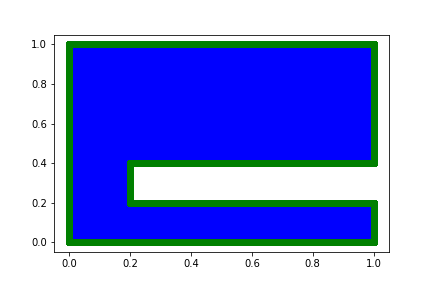
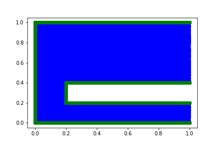
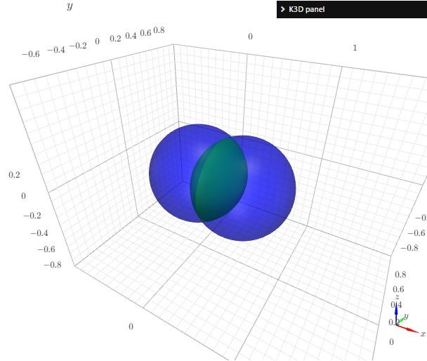
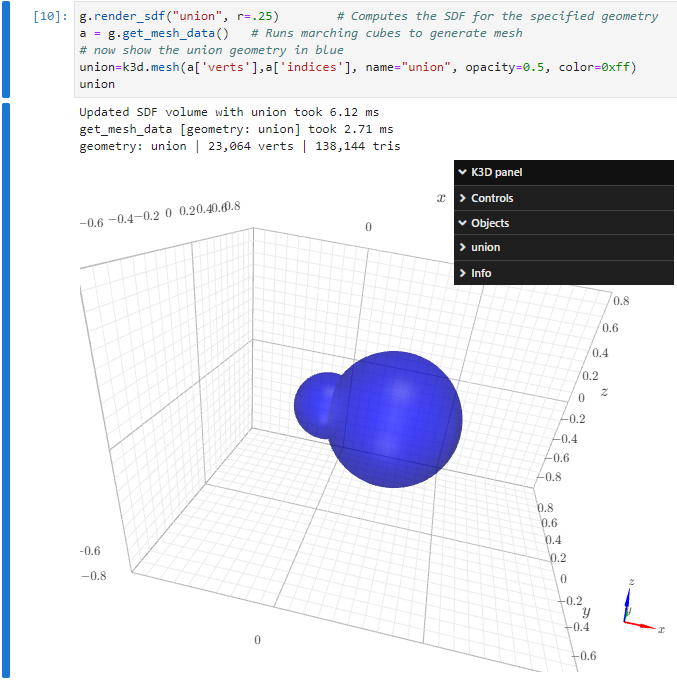

# Chapter 2: Inspecting the Point Cloud
[index](index.md)

Create a new project and put the following in `problem.py`

---
```python
from cfg import *

[x, y], [u] = p.add_neural_network(name="NN", inputs=["x", "y"], outputs=["u"])

r1 = p.Rectangle("r1", (0,0),(1,1))
r2 = p.Rectangle("r2", (0.2,0.2),(1,0.4))

geo = p.GeometryDifference("geo", r1,r2)

interior = p.add_interior_subdomain("interior", geom=geo)
boundary = p.add_boundary_subdomain("boundary", geom=geo)

p.add_constraint("wave_equation", enforce(equation=Eq(u,0), on_domain=interior))
p.add_constraint("BC", enforce(equation=Eq(u,0), on_domain=boundary))
```
---

Then initialize the configuration with `mtc init-conf` and sample the subdomains with `mtc sample`. The files for each of the constraints reside in `training/stage1/samples` and that directory should look like:
```
# ll training/stage1/samples
total 109400
drwxr-xr-x 2 root root     4096 Oct  1 20:00 ./
drwxr-xr-x 4 root root     4096 Oct  1 19:55 ../
-rw-r--r-- 1 root root 40004096 Oct  1 20:00 BC.hdf5
-rw-r--r-- 1 root root 32004096 Oct  1 20:00 wave_equation.hdf5
```

Now create a notebook at the root of the project directory and with kernel type `modulus-python`, and run the following cell:

---
```python
import matplotlib.pyplot as plt
import h5py

with h5py.File("training/stage1/samples/interior.hdf5") as f:
    print(f.keys())  
    plt.plot(f['x'], f['y'], '.')
with h5py.File("training/stage1/samples/boundary.hdf5") as f:
    print(f.keys())
    plt.plot(f['x'], f['y'], 'o')
```
---

The plot should look like this:




Now modify the `boundary` subdomain in the problem definintion by adding the criterion that `x<1` as follows:

---
```python
boundary = p.add_boundary_subdomain("boundary", geom=geo, criteria=x<1)
```
---

And run `mtc sample` followed by a rerun of the cell in the notebook. The resulting figure should remove all boundary (green) points from the right hand side.



Procedure

1. Run `mtc sample` in root project directory (as always) creates HDF5 files inside `training/stage1/samples` for each subdomain.

    Note: `mtc sample --stage stageX` is the command to sample for a specific stage; by default `stage1` will be used if not specified. See `mtc sample --help` for more.


An alternative way to display all sub-domains is this

---
```python
import numpy as np
import matplotlib.pyplot as plt
import h5py, os
dpath = 'training/stage1/samples/'
n=1000 # number of points from each sub-domain
for fname in os.listdir(dpath):
    with h5py.File(dpath+fname) as f:
        idx=np.random.choice(np.arange(f['x'].shape[0]), size=n)
        idx=np.sort(idx)
        plt.plot(f['x'][:][idx], f['y'][:][idx], '.', label=fname)
        
plt.legend()
# plt.legend(ncol=1, loc=2,bbox_to_anchor=(1.0, 1))
```
---

## Working with the Warp-based Geometry API in 2D

The geometry sub-system of Modulus allows for Constructive Solid Geometry (CSG). MTC exposes that functionality as well and facilitates geometry creation using the Geometry API through the `mtc compile --target geometry`. Depending on the spatial variables, the system will choose between 2D and 3D geometry. So, if only `x` and `y` are variables, then 2D will be selected. If `z` is used as well, then 3D is selected (see below).

This subsystem allows for to parameterize geometry definitions using the `params` construct applied to the primitive geometry types like `Circle`, `Rectangle`, `Channel2D` and set operations combining these geometries. 

The subsystem even allows one to write a new SDF function directly in Warp, which allows even more flexibility. To illustrate this functionality, here is how one would define an airfoil and parameterize it with 5 parameters.

The `problem.py` should look like this
```python
from cfg import *

[x, y, pt, rot, mm,pp,tt,cc], [u] = p.add_neural_network(name="NN", inputs=["x", "y", "pt", 'rot', 'mm', 'pp', 'tt','cc'], outputs=["u"])

params = {pt: 1.0, rot: 0.0, mm: 0.02, pp: 0.4, tt: 0.12, cc: 1.0}

ch=p.Channel2D("ch", (0.5,-1), (1,1))

#########
# Naca implementation modified from https://stackoverflow.com/questions/31815041/plotting-a-naca-4-series-airfoil
# https://en.wikipedia.org/wiki/NACA_airfoil#Equation_for_a_cambered_4-digit_NACA_airfoil

custom_warp_code="""
@wp.func
def Heaviside(a: float, h: float):
    if a == 0:
        return h
    elif a < 0:
        return float(0)
    elif a > 0:
        return float(1)


@wp.func
def camber_line(xi: float, m: float, p: float, c: float):
    z = float(0.0)
    cond_1 = Heaviside(xi, z) * Heaviside((c * p) - xi, z)
    cond_2 = Heaviside(-xi, z) + Heaviside(xi - (c * p), z)
    v_1 = m * (xi / p**2.0) * (2.0 * p - (xi / c))
    v_2 = m * ((c - xi) / (1.0 - p) ** 2.0) * (1.0 + (xi / c) - 2.0 * p)
    r = cond_1 * v_1 + cond_2 * v_2
    return r


@wp.func
def thickness(xi: float, t: float, c: float):
    term1 = 0.2969 * (sqrt(xi / c))
    term2 = -0.1260 * (xi / c)
    term3 = -0.3516 * (xi / c) ** 2.0
    term4 = 0.2843 * (xi / c) ** 3.0
    term5 = -0.1015 * (xi / c) ** 4.0
    r = 5.0 * t * c * (term1 + term2 + term3 + term4 + term5)
    return r
    
@wp.func
def naca_sdf(tp: wp.vec2, m: float, p: float, t: float, c: float, angle: float):
    c = wp.cos(angle)
    s = wp.sin(angle)
    x = tp[0]
    y = tp[1]
    tp = wp.vec2(c*x +s*y, -s*x +c*y)
          
    tx = tp[0]
    ty = tp[1]
    N = 200
    dx = float(1.0) / float(N)

    d = float(1e9)
    for pxid in range(N):
        xi = float(pxid) * dx
        xi_1 = float(pxid) * dx + dx

        cli = camber_line(xi, m, p, c)
        cli_1 = camber_line(xi_1, m, p, c)

        px = xi
        py = cli
        yt = thickness(xi, t, c)
        pd = wp.sqrt((px - tx) * (px - tx) + (py - ty) * (py - ty))
        d = wp.min(pd - yt, d)

    return d
"""
a = p.GeometryCustomWarp("custom_airfoil", 
                         custom_warp_code, 
                         "naca_sdf", # which function in the custom code to call
                         [mm,pp,tt,cc,rot], # list of arguments for this function
                         params=params)
p.GeometryUnion("union", ch,a)
p.GeometryIntersection("intersection", ch,a)
p.GeometryDifference("diff_ch_a", ch,a)

```

Note that we use the `GeometryCustomWarp` function to define the custom geometry. We gave the custom geometry a name (as with all other geometries), we specified which of the functions defined in the custom code to call to compute the SDF, and gave the list of arguments for that function. Now, we can generate the geometry module with
```bash
#mtc clean  # optional
mtc compile --target geometry
```
And the code below may be run in a notebook to visualize the result.
```python
import numpy as np
import matplotlib.pyplot as plt
from training.stage1.geometry import Geometry

g = Geometry()

gnames = [ "custom_airfoil","diff_ch_a", ]
angles = [ 0, -20 ]
f, axs = plt.subplots(len(angles),len(gnames), figsize=(9,4*len(angles)))

rat = 5
mx = 1.2
x = np.linspace(-1, 2, 300)
y = np.linspace(-1.1,1.1, 300)
X,Y=np.meshgrid(x,y)
xy = np.vstack([X.ravel(), Y.ravel()]).T

for ai, angle in enumerate(angles):
    for gi, gn in enumerate(gnames):
        sdf = g.sdf(gn, xy,rot=angle/180.*np.pi, mm = 0.02*4, tt=.2).reshape(X.shape)
        sdf[sdf>=0.]=np.nan
        axs[ai,gi].scatter(X,Y, c=sdf, s=5); 
        axs[ai,gi].set_title(f"{gn} | {angle} deg")
        axs[ai,gi].axis("equal")

plt.tight_layout()
```


Now the following may be used to sample the interior and boundary of the geometry.
```python
g.sample_boundary(geom_name, n, tol=1e-2, ...)
g.sample_interior(geom_name, n, ...)
```

## Working with 3D and the Geometry API

The geometry sub-system of Modulus allows for Constructive Solid Geometry (CSG). MTC exposes that functionality as well and facilitates geometry creation using the Geometry API through the `mtc compile --target geometry`. Here is a simple non-trivial example showing multiple geometries:

1. Create a new project
2. Create a `problem.py` file with the following (note that the radius for `sphere1` is a parameter `r`)
```python
from cfg import *
[x, y, z, r], [u] = p.add_neural_network(name="NN", 
                                         inputs=["x", "y", "z", "r"], 
                                         outputs=["u"])
params = {r:0.5}
sphere1 = p.Sphere("sphere1", (0,0,0), r, params=params)
sphere2 = p.Sphere("sphere2", (0.5,0,0), .5)
union = p.GeometryUnion("union", sphere1, sphere2)
intersection = p.GeometryIntersection("intersection", sphere1, sphere2)
diff = p.GeometryDifference("difference", sphere1, sphere2)
```

3. Then, in a notebook run the following cell
```python
import k3d
p = k3d.plot()
!mtc compile --target geometry

from training.stage1.geometry import Geometry
g = Geometry(200)

g.render_sdf("union")        # Computes the SDF for the specified geometry
a = g.get_mesh_data()   # Runs marching cubes to generate mesh
# now show the union geometry in blue
union=k3d.mesh(a['verts'],a['indices'], name="union", opacity=0.5, color=0xff)

g.render_sdf("intersection") # Computes the SDF for the specified geometry
a = g.get_mesh_data()   # Runs marching cubes to generate mesh
# now show the intersection geometry in green
intersection=k3d.mesh(a['verts'],a['indices'], name = "intersection", opacity=1.0, color=0xff000)

g.render_sdf("difference") # Computes the SDF for the specified geometry
a = g.get_mesh_data()   # Runs marching cubes to generate mesh
# now show the difference geometry in green
difference=k3d.mesh(a['verts'],a['indices'], name = "difference", opacity=1.0, color=0xff0000)

p += union
p += intersection
p += difference
p
```



The Geometry API is provided through the `geometry.py` module compiled from the `problem.py` definition. This make it specific to the project. For example, the SDF rendering calls take the form of `render_sdf(X)` where `X` is the name of the geometry specified in the `problem.py` file (the first argument to a geometry call). In the above example, `X` is any of `sphere1`, `sphere2`, `union`, or `intersection`. The list can be obtained with `g.list_geometries()`. Also, `g.render_sdf()` takes an optional argument `r` to specify the parameter, so `g.render_sdf("sphere1", r=0.25)` will create a smaller sphere than the default in this example. Note that this parameter carries to all geometries.

Here is an example of using `r` to render the `union` geometry. In a new cell run
```python
g.render_sdf("union", r=.25)        # Computes the SDF for the specified geometry
a = g.get_mesh_data()   # Runs marching cubes to generate mesh
# now show the union geometry in blue
union=k3d.mesh(a['verts'],a['indices'], name="union", opacity=0.5, color=0xff)
union
```



The Geometry API also allows for SDF calculations (through `g.sdf(geom_name, xyz: np.array, optional_parameters)`) and for adjusting the mesh vertex points (through `g.adjust_points`). More documentation is forthcoming.

## Tutorial Witer's Notes (TODOs):

1. Give step by step instructions on how to sample a problem with the two kinds of domain (interior and boundary), and then how to plot them

1. Add an exercise to generate a couple of non-trivial 2D/3D geometries and plot the sampled points. E.g., geom like `rect1-rect2-circle`

1. Show that sampling is useful to see what variables are available to the subdomains. In particular, that boundary subdomains and interior subdomains define/compute different additional variables (e.g., `normal_x` ofr bdry and `sdf` for interior)