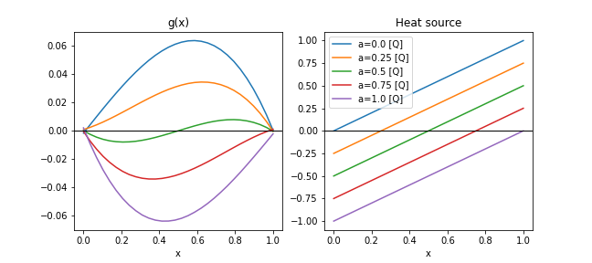
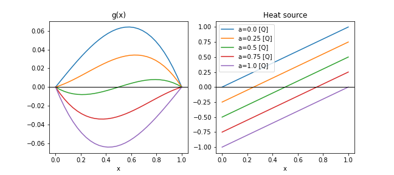
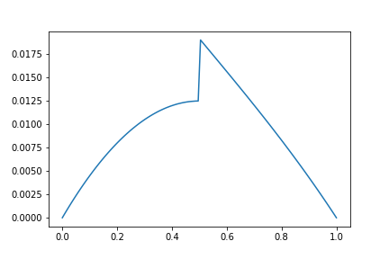
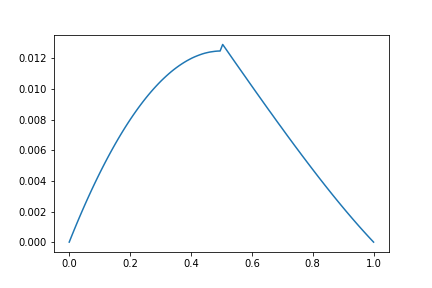
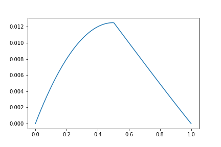

# Chapter 3: Sub-Models and Piece-wise Models
[index](index.md)

## Sub-Models

So far the boundary conditions were provided in a soft or inexact way essentially using a point cloud to define the the value $g(x)$ at the boundaries. After 1000 steps the results were as follows:


Note that $g(0)$ and $g(1)$ are not exactly 0 in all cases, thought they are close.

To remedy this kind of problem and ensure the BCs are enforced, we can define sub-models. The idea is to define $g(x) = u(x) x (x-1)$ where $u(x)$ is the unknown function to adjust. Note that $g(0)=g(1)=0$ by definition. In general, we can define submodels as follows:
```python
# g = p.sub_model(name, expression)
g = p.sub_model("g", u*x*(x-1))
```

The problem is again:
$$
\begin{align}
g(0)&=&0&\\
g(1)&=&0&\\
g_{xx}(x) + (x-a) &=&0&, \qquad x\in (0,1), \quad a\in(0,1)
\end{align}
$$

So the new `problem.py` implementing exact BCs through a sub-model looks like this:

---
```python
from cfg import *

[x, a], [u] = p.add_neural_network(name="NN", inputs=["x", 'a'], outputs=["u"])

geom = p.Line1D("geom", 0,1)
interior = p.add_interior_subdomain("interior", geom=geom, params={a:(0,1)})

g = p.add_submodel("g", x*(x-1)*u)
diff_eq = Eq(g.diff(x,2) + (x-a), 0)
p.add_constraint("diffusion", enforce(equation=diff_eq, on_domain=interior))
```
---

Note that we dropped the `bdry` constraint. And the results are now:



## Piecewise Models

Now suppose we are trying to solve a problem in which two species -- metal and paper -- exchange heat. Think of it as a 1D problem where the left half is metal and the right half is paper. Only the metal generates heat and the two ends of the domain (the interval (0,1)) are kept at a constant temperature. In other words:
$$
\begin{align}
T(0)&=&0&\\
T(1)&=&0&\\
1000T_{xx}(x) + 100 &=&0 &, \qquad x \in (0,1/2) \quad \text{metal}\\
T_{xx}(x) &=&0 &, \qquad x \in (1/2,1) \quad \text{paper}\\
\end{align}
$$

So the diffusion coefficient in the metal is 1000 times that of the paper.

It turns out that the direct translation of this problem using a single neural network for $T$ does not work. We need to split the interval into the metal domain and the paper domain, apply the respective heat equation in each domain, and add two coupling constraints-- one for continuity of $T$ and one for the continuity of heat flux. The `problem.py` formulation becomes:

---
```python
from cfg import *

[x], [u_metal] = p.add_neural_network(name="metalNN", inputs=["x"], outputs=["u_metal"])
[x], [u_paper] = p.add_neural_network(name="paperNN", inputs=["x"], outputs=["u_paper"])

T_metal = p.add_submodel("T_metal", u_metal * x)
T_paper = p.add_submodel("T_paper", u_paper * (x-1))

geom = p.Line1D("geom", 0, 1)

interior_metal = p.add_interior_subdomain("interior_metal", 
                                          geom=geom, criteria=x<=1/2)
interior_paper = p.add_interior_subdomain("interior_paper", 
                                          geom=geom, criteria=x>=1/2)
interface = p.add_boundary_subdomain("interface", 
                                          geom=p.Point1D('pt', 1/2))


p.add_constraint("metal_diff", enforce(equation=Eq(1000*T_metal.diff(x,x)+100,0), 
                                          on_domain=interior_metal))
p.add_constraint("paper_diff", enforce(equation=Eq(T_paper.diff(x,x),0), 
                                          on_domain=interior_paper))

p.add_constraint("interface_eq", enforce(equation=Eq(T_paper,T_metal), 
                                          on_domain=interface))
p.add_constraint("interface_flux", 
                 enforce(equation=Eq(T_paper.diff(x),1000*T_metal.diff(x)), 
                         on_domain=interface))

p.set_model(
    "T",
    [
        {"func": T_metal, "on": x<1/2},
        {"func": T_paper, "on": ~(x<1/2)},
    ],
)
```

Observe that we have introduced a new concept here: the piecewise model at the very end. It is a convenience that can help keep track ov models during the inference stage. After running `mtc clean; mtc init-conf; mtc train`, run the following in a notebook:

---
```python
import numpy as np
import matplotlib.pyplot as plt
import training.stage1.infer as infer1

x = np.linspace(0,1, 120)
T = infer1.infer(x=x, outputs=["T_metal", "T_paper", "T"])['T']
plt.plot(x,T)
```
---

The result after 1000 steps is not great yet, but it shows promise



and after 5000 steps



and finally after 10000 steps



Interestingly, the same result may be obtained 10 times faster by rescaling the equations. Simply multiply both sides of all the equations in the constraints above by a variable `sc=1/100` and the converged result will be obtained in 1000 steps or less. Note that this scaling does not change the problem -- it is equivalent -- but it does have an effect on the optimization procedure that finds the unknown functions.