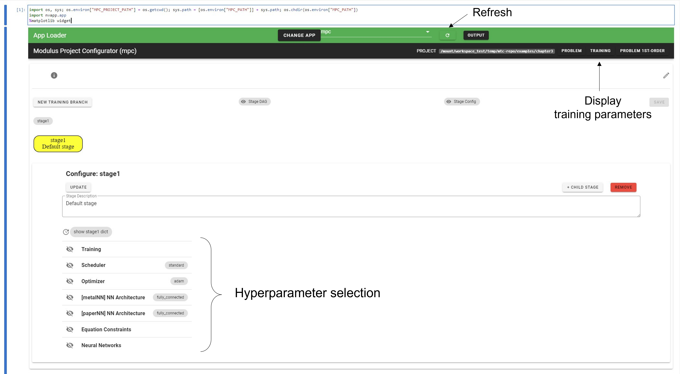
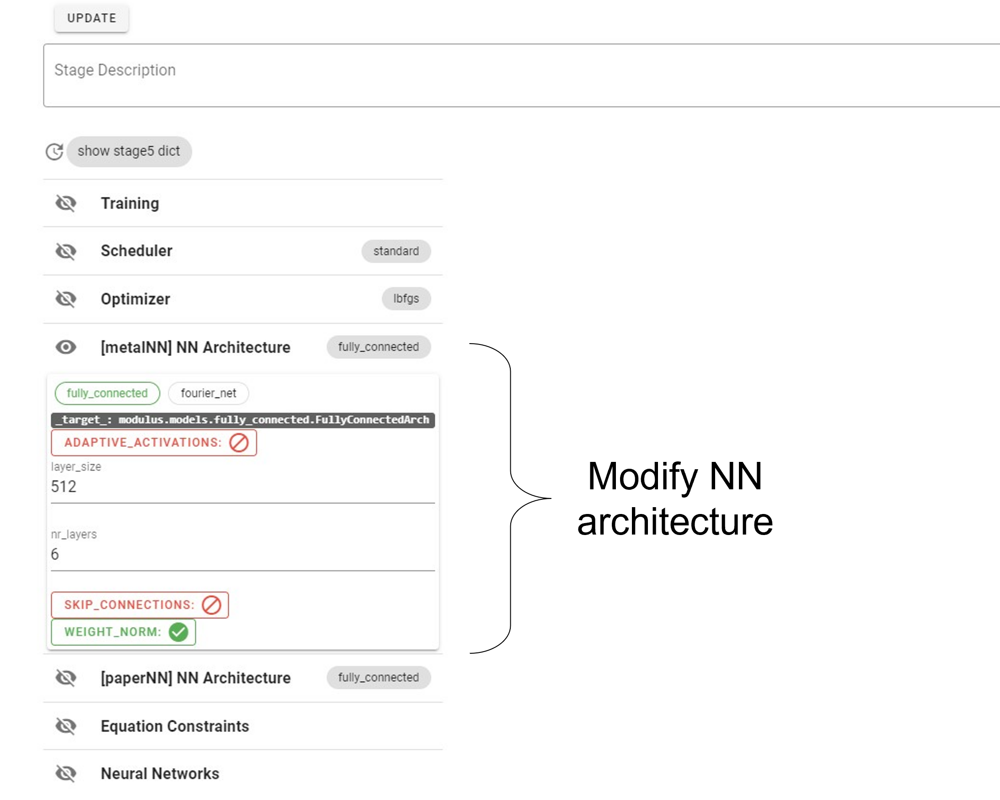
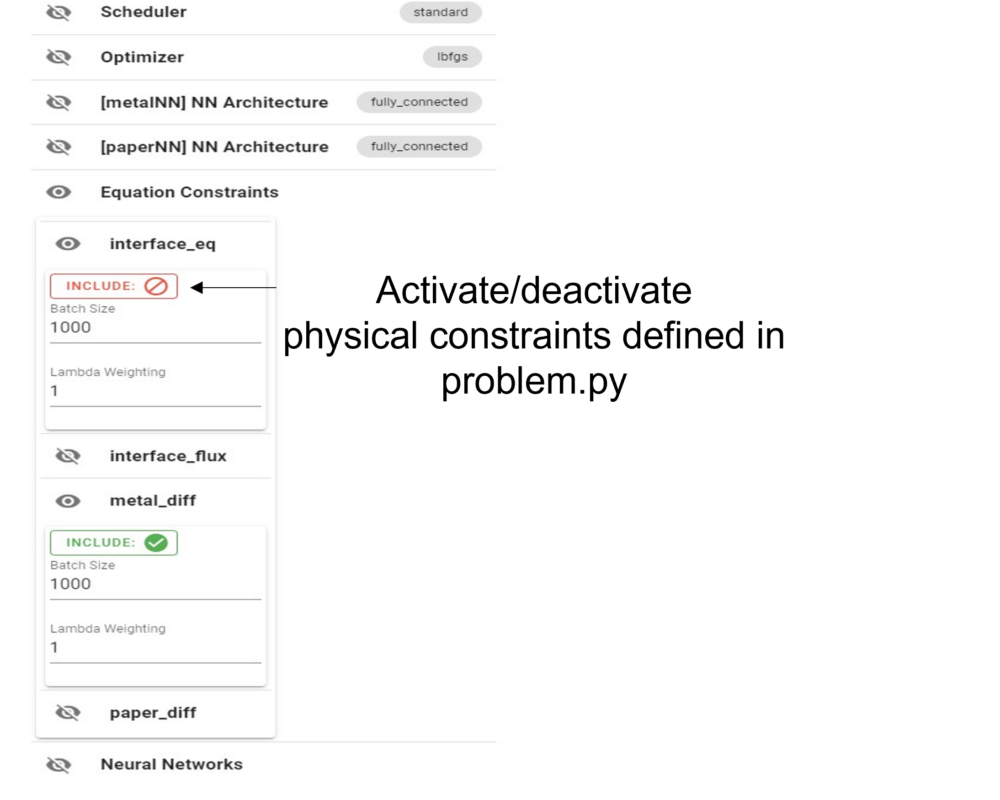
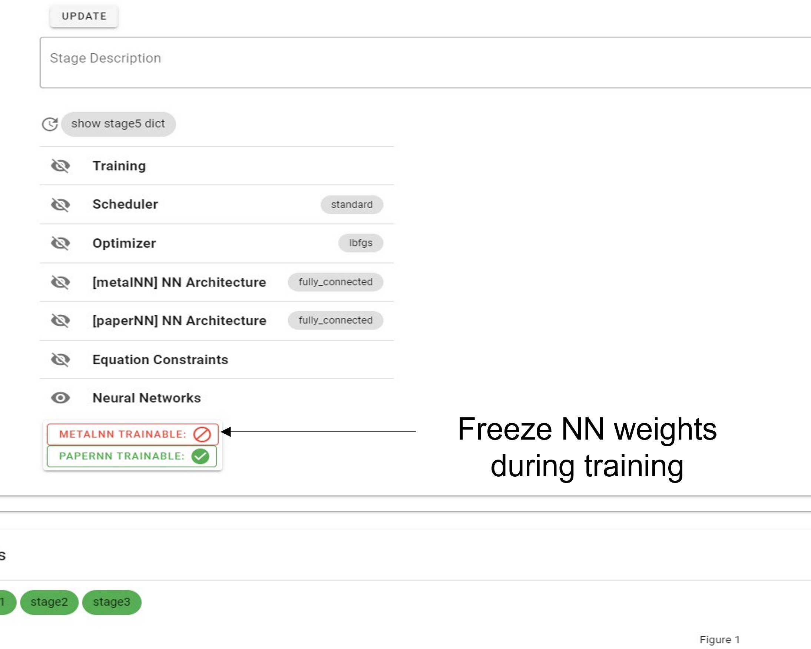
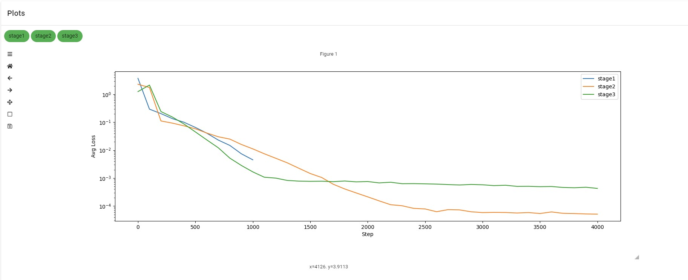
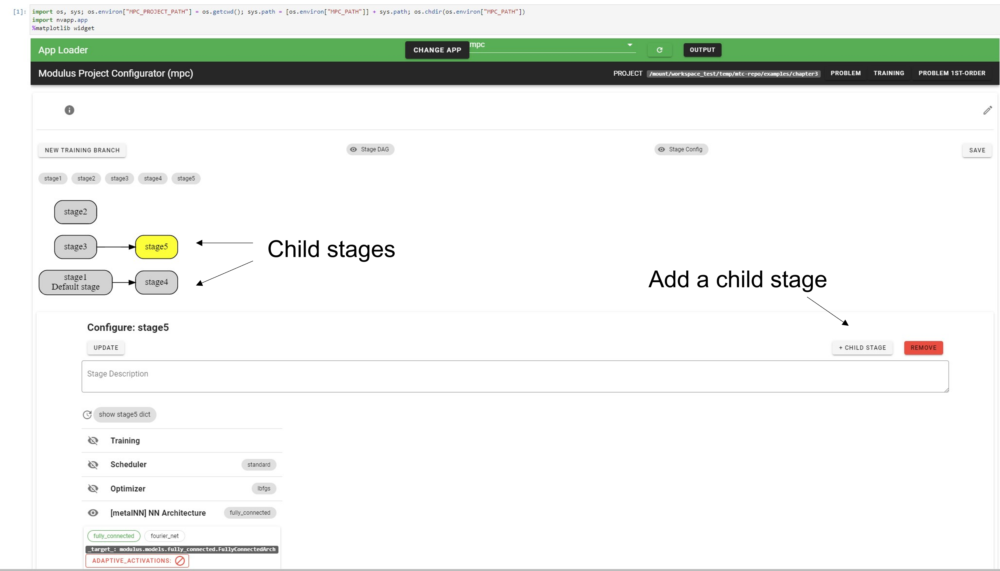

# Chapter 5: Multi-Stage Training
[index](index.md)

## Motivation
One of the goals of Modulus Tool Chain (MTC) is to separate the problem definition (`problem.py`) from the training procedure (i.e., the optimization process). So far, we showed how to define and construct a problem from a physical standpoint. In this chapter, we show how to solve this optimization problem using deep learning (DL) techniques. Conventional DL approaches usually require to test/tune a very large range of hyperparameters during training and accurately monitor their performances. Consequently, it can be difficult to efficiently keep track of all the hyperparameter combinations that are being tested.        

To facilitate this critical step, we introduce a configuration tool which  is a pre-populated notebook inside the MTC project directory. This notebook serves as a user interface (UI) to intuitively build custom multi-stage pipelines when training physics-informed neural nets (PINN). More specifically, this tool allows the user to:

- **Test and conveniently keep track** of the different hyper-parameters employed during training (e.g., NN architecture, training batch size, gradient-descent optimization scheme, learning rate scheduler, etc.)
- **Monitor, visualize, and compare** model performance for each hyperparameter selection by plotting the corresponding loss functions on the same graph
- **Easily create** multi-stage training workflows. For instance, one can: 
    - Build a two-stage pipeline where one network is trained first, and then the second one is trained in the next stage.
    - Add a third stage to train both pre-trained networks but with L-BFGS optimizer instead of Adam.
    - Create a separate training branch to explore training in a single stage but with Fourier Net architecture for all NNs instead of the default Fully Connected architecture.

We revisit the example proposed in [Chapter 3](ch3-piecewise-models.md) to show how the configuration tool can be used.

## Starting the configurator
1. Create a new project by running: `mtc create multi-stage`
2. Replace `problem.py` with the one from Chapter 3:

---
```python
from cfg import *

[x], [u_metal] = p.add_neural_network(name="metalNN", inputs=["x"], outputs=["u_metal"])
[x], [u_paper] = p.add_neural_network(name="paperNN", inputs=["x"], outputs=["u_paper"])

T_metal = p.add_submodel("T_metal", u_metal * x)
T_paper = p.add_submodel("T_paper", u_paper * (x-1))

geom = p.Line1D("geom", 0, 1)

interior_metal = p.add_interior_subdomain("interior_metal", 
                                          geom=geom, criteria=x<=1/2)
interior_paper = p.add_interior_subdomain("interior_paper", 
                                          geom=geom, criteria=x>=1/2)
interface = p.add_boundary_subdomain("interface", 
                                          geom=p.Point1D('pt', 1/2))


p.add_constraint("metal_diff", enforce(equation=Eq(1000*T_metal.diff(x,x)+100,0), 
                                          on_domain=interior_metal))
p.add_constraint("paper_diff", enforce(equation=Eq(T_paper.diff(x,x),0), 
                                          on_domain=interior_paper))

p.add_constraint("interface_eq", enforce(equation=Eq(T_paper,T_metal), 
                                          on_domain=interface))
p.add_constraint("interface_flux", 
                 enforce(equation=Eq(T_paper.diff(x),1000*T_metal.diff(x)), 
                         on_domain=interface))

p.set_model(
    "T",
    [
        {"func": T_metal, "on": x<1/2},
        {"func": T_paper, "on": ~(x<1/2)},
    ],
)
```
3. If you look inside the `multi-stage` project directory, you will see an auto-generated notebook (`configurator.ipynb`): **this is the configuration tool (UI)**
4. Run `mtc init-conf` to enable to the tool (only needs to be run once). Open the notebook, run the first cell, and press the `refresh` button (circular arrow) located inside the green horizontal layer at the top (next to `output`). At this point, you should be able to see two main windows in the notebook: `Configure` and `Plots`.



## Hyperparameter selection
In the `Configure` window, the user can modify the various hyperparameters for training the NN. For the specific example from Chapter 3, the selection is divided into seven sections:
- Training
- Scheduler
- Optimizer
- [metalNN] NN Architecture
- [paperNN] NN Architecture
- Equation Constraints
- Neural Networks

In each section, the user can modify the parameters and click on the `UPDATE` button followed by the `SAVE` button for the modifications to be taken into account (before launching the training process). The first three sections (`Training`, `Scheduler`, and `Optimizer`) allow the user to modify standard DL parameters (number of epochs, gradient-descent method, etc.). The `NN Architecure` sections allow the user to modify the various NN architectures defined in `problem.py` (Fully Connected/Fourier Nets, number of layers, layer size, etc.). 



In the `Equation Constraints` section, it is possible to  activate/deactivate some of the constraints also defined in `problem.py`. In the figure below, the "interface_eq" constraint has been deactivated. 



Finally, in the `Neural Networks` section, the user can freeze the weights of one or many NNs during the training procedure. For example, the figure below indicates that the NN for the metal region of the model will not be updated during the training stage 



## Building a multi-stage training workflow
### Visualizing the convergence curves
Launch the same training process as the one from Chapter 3 by running:

```
mtc train
```
or equivalently,

```
mtc train --stage stage1
```
Note that when no argument is given in front of the command `mtc train`, it defaults to stage 1. Click the `refresh` button in the notebook, and go the `Plots` section at the bottom. You now have a `stage1` box. Click on it, and the convergence curve (loss function as a function of iteration) is plotted (the y-axis is displayed in log scale).  

### New branch
After running the first stage of the training process, let us create a second stage by re-training (from scratch) the neural net with different parameters (note that it does not need to be the exact same NN). Click on `NEW TRAINING BRANCH`, you will see a yellow box appearing saying `stage2`. The color yellow indicates that all the modifications made to the hyperparameters will be taken into account only for stage 2. You can flip back and forth between `stage1` (the default stage) and `stage2`, `stage3`, etc. 

For stage 2, set the `max_steps` parameter to 4000 instead of 1000 (you can also experiment with different NN architectures, etc.). Click on `UPDATE`, then `SAVE`. At the top of the notebook, click on `TRAINING`, and you will see a pop-up window detailing the two training stages created for this problem along with the hyperparameter selection. You can also display this information from the command line by running:

```
mtc show training 
```
Now we are ready to launch stage 2: 

```
mtc train --stage stage2
```
As the training is being performed, refresh the notebook and notice in the `Plots` section that a `stage2` button has appeared, which allows you to display the loss function for stage 2. Note that you do not need to wait for the training to be done to plot the convergence curves. The convergence curves for stage 1 and 2 can be overlaid on the same plot.

Now, you can add new training stage (stage 3) and vary the different hyperparameters: learning rate, learning rate decay, optimization method, NN architecture, etc. We recommend testing as many combinations of parameters as possible to get familiar with the tool. The figure below illustrates how the loss functions from three different training stages can be displayed on the same plot for comparison.



### Child stage
The configurator interface also permits the user to train a NN with a set of hyperparameters, save the output model, and continue training this output with a different set of hyperparameters. For the Chapter 3 example, the user may want to freeze the weights of the NN corresponding to the metal region in stage 1, and later update them in a child stage. This is done by clicking on the `+CHILD STAGE` button on the right side of the notebook. Once a child stage is created, the same training procedure as the one described in the above section can be followed.   

 

## Notes 
- Starting the `configurator.ipynb` notebook may take up to a few minutes  
- Any configuration changes done through the UI **will be deleted** each time `mtc init-conf` is run. In other words, if you create many branches (and child stages) and then run `mtc init-conf`, everything will be deleted. 
- Once a training branch is launched, a stageX directory will be created inside ${MAIN_DIRECTORY}/training/ which will contain the trained model (and other things) for stage X
- You can reset/restart all stages by running the following:

```
mtc clean
```
This will simply delete all stages folders.  
- You can reset/restart a specific stage with the following command 

```
mtc clean --stage stage2
```
Unlike `mtc init-conf`, `mtc clean` only deletes the training results (+folders), but does not remove the stages previously created. 
 

## 
<!-- But `mtc init-conf` must be run once to enable to the tool. -->


