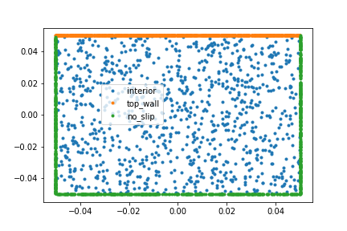

# A Conceptual Framework for PINNs and Modulus

## Motivation

Suppose that we need to solve a Lid-Driven Cavity Flow [1] problem with a geometry shown in the figure below.



The flow is left to right (increasing $x$ direction) induced by a velocity at the top wall and the behavior inside the geometry is described by a simplified version of the Navier-Stokes equations 

$$
\begin{split}\begin{aligned}
\frac{\partial u}{\partial x} + \frac{\partial v}{\partial y} &= 0\\
u\frac{\partial u}{\partial x} + v\frac{\partial u}{\partial y} &= -\frac{\partial p}{\partial x} + \nu \left(\frac{\partial^2 u}{\partial x^2} + \frac{\partial^2 u}{\partial y^2} \right)\\
u\frac{\partial v}{\partial x} + v\frac{\partial v}{\partial y} &= -\frac{\partial p}{\partial y} + \nu \left(\frac{\partial^2 v}{\partial x^2} + \frac{\partial^2 v}{\partial y^2} \right)\end{aligned}\end{split}
$$

And, for specificity, we also assume $\nu=0.01$. Note that this version is about the equilibrium behavior (or steady-state) after a sufficiently long time, so there is no temporal dependence.

This is now a well-defined problem which asks to find the three **unknown functions**: 

$$p(x,y), \quad u(x,y), \quad  v(x,y)$$

## Solving PDEs with Non-Linear Optimization

To solve the problem we just defined we need at least two more things: (1) a representation of the three functions, and (2) a method to obtain the solution using that representation.

### Representation
In the Modulus framework we represent an unknown function $f(x)$ as an *adjustable function* $f(w; x)$ where $w$ represents a vector of weights that, in effect, make $f(w; x)$ a family of functions. A desired solution, therefore, means finding an appropriate $w$. This approach is common in many areas of numerical analysis--for example, the family $f(w; x)$ may be polynomials of degree $n$ where the vector $w$ encodes the $n$ coefficients. More generally, linear combinations of any number of basis functions be described in this way. But the preferred representation in Modulus is a deep neural network.

**Note 1** The unknown functions in the problem above should **not** be thought of as a neural network. A single neural network may be used to represent one or several unknown functions. Likewise, a single unknown function may have to be represented by multiple neural networks. The concept of an **unknown function** pertains to the definition of the mathematical problem, while neural networks are just representational constructs useful in finding the solution to the problem. The Modulus Tool Chain (MTC) aims to keep these concepts clearly separated.

**Note 2** The choice of functional family is important because it needs to be expressive enough to represent the solution of the problem. A polynomial of degree 1 is not enough for many problems, but there is an $n$ for which a polynomial of degree $n$ should be sufficient. Likewise, many architectures of neural networks are known to be "universal approximators" but choosing the correct configuration may be non-trivial. Allowing to experiment with such configurations is one reason to keep the configuration separate from the problem definition.

### Optimization Method

The preferred method to find appropriate $w$ vectors is a version gradient descent using an objective function. So the remaining question is how to build the this objective function.

Fundamentally, the objective function is built by devising criteria that compare the behavior of the current unknown functions $f(w; x)$ with the desired behavior on a finite set of discrete points. We talk about a "purely data-based" approach when those points are obtained from a measurement, a simulation, or otherwise externally to Modulus. And we usually talk about a "physics approach" when those data points are obtained using a Modulus sampling method to extract the point locations together with a function evaluation on those locations based on equations involving the functions $f(w; x)$ (typically differential equations). For example, assuming we want to solve the Lid-Driven Cavity flow problem over a compact space (as in the Figure above), then we can randomly sample that space (as shown in the figure) and evaluate the PDEs at all of those locations. The sum of all squares of all those evaluation then add up to form our objective function.

Of course, just as there are many ways to represent the unknown functions (linear combinations of basis function, neural networks with architecture 1, 2, 3, ...) there are many ways to build the objective function. One may prefer to weigh one constraint higher than another, or one sub-domain differently from another, or combine the constraints in ways other than a weighted sum. In addition, we have several options for the exact sub-algorithm used to perform the gradient-based optimization (Adam, BFGS, etc.). But, in both aspects, there is a relatively clear line between describing the mathematical problem (the domain, the constraints exploiting equations using unknown functions, etc.) and how to solve it (the choice of NN architecture, optimization configuration, etc.).

## Separating Problem from Solution: Modulus Tool Chain

Modulus offers a number of conveniences to perform all the steps outlined above. It has many ways to represent unknown functions (growing list of NN architectures like Fully Connected, Fourier Nets, etc.). It has a growing library of geometry primitives to build and sample the problem domains. It has a number of optimization algorithms implemented. And it makes most of that run in parallel and at scale (multiple GPUs and on multiple nodes).

So the goal of the Modulus Tool-Chain is to expose those facilities while providing a suite of tools that facilitate the development, training, and deployment of PINNs (neural operators not currently included). The aim is to provide sufficient support for the whole workflow in addition to a simplified API. More specifically

- Simplified API that clearly separates problem definition (`problem.py`) from training (solving the problem) and inference (using the solution)

- Project management facilities
    - Creation, cloning / replicating / extending projects
    - Introspection and analysis
    - Training process control (start/stop, multi-stage training, history clearing, multi-gpu/node)
    - Using the trained models easily (Inference)
    - Simplified configuration initialization and validation (e.g. a Configurator GUI)


At a high level, the toolchain is intended to work as the following diagram shows:


## Appendix: Lid-Driven Cavity Flow Problem

As an example of using the MTC on a non-trivial problem, here is a version of the Lid-Driven Cavity Flow problem discussed in the motivation.
The current Modulus documentation introduces describes this problem:  [Lid-Driven Cavity Flow](https://docs.nvidia.com/deeplearning/modulus/user_guide/basics/lid_driven_cavity_flow.html).

In MTC, this problem may be fully described in the next 30 lines. Saving those in a `problem.py` file and then running `mtc init-conf; mtc train` is all it takes to produce a solution. More advanced configuration (more training steps, adaptive weighting using the `sdf`, etc.) may be specified with the provided configuration tool (see [Chapter 5](ch5-multi-stage-training.md))

---
```python
from cfg import *

[x, y], [u,pp,v] = p.add_neural_network(name="NN", inputs=["x", "y"], outputs=["u", "p", "v"])
# [x, y], [u]  = p.add_neural_network(name="uNN", inputs=["x", "y"], outputs=["u"])
# [x, y], [v]  = p.add_neural_network(name="vNN", inputs=["x", "y"], outputs=["v"])
# [x, y], [pp] = p.add_neural_network(name="pNN", inputs=["x", "y"], outputs=["p"])

continuity_eq = Eq(u.diff(x) + v.diff(y), 0)

nu = 0.01
momentum_x = Eq(u*u.diff(x)+v*u.diff(y), -pp.diff(x)+nu*(u.diff(x,x)+u.diff(y,y)) )
momentum_y = Eq(u*v.diff(x)+v*v.diff(y), -pp.diff(y)+nu*(v.diff(x,x)+v.diff(y,y)) )

height = 0.1
width = 0.1
rec = p.Rectangle('rec', (-width / 2, -height / 2), (width / 2, height / 2))

top_wall = p.add_boundary_subdomain('top_wall', geom=rec, criteria=Eq(y, height/2))
no_slip = p.add_boundary_subdomain('no_slip', geom=rec, criteria=y < height/2)
interior = p.add_interior_subdomain('interior', geom=rec)

p.add_constraint("top_wall_u", enforce(equation=Eq(u, 1), on_domain=top_wall))
p.add_constraint("top_wall_v", enforce(equation=Eq(v, 0), on_domain=top_wall))

p.add_constraint("no_slip_u", enforce(equation=Eq(u, 0), on_domain=no_slip))
p.add_constraint("no_slip_v", enforce(equation=Eq(v, 0), on_domain=no_slip))

p.add_constraint("interior_continuity", enforce(equation=continuity_eq, 
                                                on_domain=interior))
p.add_constraint("interior_momentum_x", enforce(equation=momentum_x, 
                                                on_domain=interior))
p.add_constraint("interior_momentum_y", enforce(equation=momentum_y, 
                                                on_domain=interior))
```
---

## References

[1] Modulus Documentation on Lid-Driven Cavity Flow: https://docs.nvidia.com/deeplearning/modulus/user_guide/basics/lid_driven_cavity_flow.html

[2] Modulus Documentation: https://docs.nvidia.com/deeplearning/modulus/index.html

[3] Modulus container image from ngc.nvidia.com: https://catalog.ngc.nvidia.com/orgs/nvidia/teams/modulus/containers/modulus