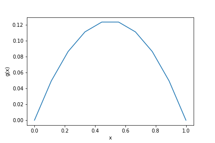
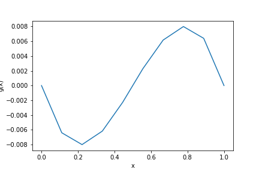
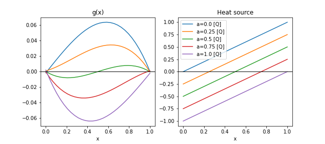

# Chapter 1: A "Hello world!" PINN
[index](index.md)

# A quick tour

Let's solve a 1D steady-state heat equation problem where the function `u(x)` is required to satisfy:

$$\begin{align}
u(0)&=&0&\\
u(1)&=&0&\\
u_{xx}(x) + 1 &=&0&, \qquad x\in (0,1)
\end{align}$$

Here is the quick version, detailed explanations below
1. Create a new project by running: `mtc create hello-world`
1. Enter the newly created `hello-world` directory and edit `problem.py` so it looks like this

    ---
    ```python
    from mtc.problem import *
    from cfg import p

    [x], [u] = p.add_neural_network(name="NN", inputs=["x"], outputs=["u"])
    
    geom = p.Line1D("geom", 0,1)
    interior = p.add_interior_subdomain("interior", geom=geom)
    bdry = p.add_boundary_subdomain("bdry", geom=geom)

    diff_eq = Eq(u.diff(x,2) + 1, 0)
    p.add_constraint("diffusion", enforce(equation=diff_eq, on_domain=interior))
    p.add_constraint("bdry", enforce(equation=Eq(u,0), on_domain=bdry))
    ```
    ---
    **Note:** As you type the problem definition in `problem.py` it may be helpful to run `mtc show problem` in the console. Each time this command runs, it will partially compile the problem and report errors or warnings.

1. Then save the file and run `mtc init-conf` in the same directory. This will generate a default project configuration, a summary of which is available with `mtc show training`

    ---
    ```
    $ mtc init-conf
    $ mtc show training
    Stage DAG: 

    stage1 ----------------------------------------
    [ description] Default stage
    [   optimizer] adam, steps < 1000
    [         NNs] [training] NN: fully_connected
    [ constraints] bdry
                   diffusion
    ========================================    
    ```
    ---

1. Finally, run `mtc train` to train the PINN model.
1. After 1000 steps the model is ready to use!


To inspect the result of training, create a notebook in the project root making sure to use the `modulus-python` kernel. Run the following
```python
import numpy as np
import matplotlib.pyplot as plt

import training.stage1.infer as infer1
```
This will load the inference module created for this project by MTC. The type of available inference may be seen by running (in the next cell)
```python
[cell]: infer1.info
[output]: {'stage': 'stage1',
 '__file__': '/workspace/mtc/demo/training/stage1/infer.py',
 'inputs': ['x'],
 'default-outputs': ['u'],
 'possible-outputs': ['u', 'diffusion', 'bdry']}
 ```
This shows that both the function `u(x)` is available. So we can display the value of `u(x)` with
```python
x = np.linspace(0,1, 10)
plt.plot(x, infer1.infer(x=x)['u'])
```


Now we can go back to the problem and make it a bit more interesting. Let's change the heat source from a constant of 1, to a function that depends on `x`. Replace the line in `problem.py` with the diffusion equation with the following one:
```python
diff_eq = Eq(g.diff(x,2) + (x-0.5), 0)
```
So the heat source is negative near `x=0`, becomes 0 at the midpoint, and then is positive at `x=1`.
$$g_{xx} + (x-0.5) = 0$$

To retrain, we first have to clear the last results and then train again by running
```
mtc clean
mtc train
```
Restarting the kernel and running all the cells again in our inspection notebook will now produce the following figure:



# What happened?

Now let's take a look at the problem and the tools we used in more detail.

# PINN Parameterization

In the introduction we quickly modified the problem into this one:
$$
\begin{align}
g(0)&=&0&\\
g(1)&=&0&\\
g_{xx}(x) + (x-0.5) &=&0&, \qquad x\in (0,1)
\end{align}$$

And we can also parameterize this problem in a variety of ways. To illustrate the MTC facilities to do so, let's start by parameterizing the source term in the following way:
$$
\begin{align}
g(0)&=&0&\\
g(1)&=&0&\\
g_{xx}(x) + (x-a) &=&0&, \qquad x\in (0,1), \quad a\in(0,1)
\end{align}
$$

We can solve this parameterized set of equations with a single PINN model. The procedure is exactly as above, but adding `a` as a parameter.

1. Create a new project with `mtc create hello-world-param-a`
1. Modify the `problem.py` definition to look like

    ---
    ```python
    from cfg import *

    [x, a], [g] = p.add_neural_network(name="NN", inputs=["x", 'a'], outputs=["g"])

    geom = p.Line1D("geom", 0,1)
    interior = p.add_interior_subdomain("interior", geom=geom, params={a:(0,1)})
    bdry = p.add_boundary_subdomain("bdry", geom=geom, params={a:(0,1)})

    diff_eq = Eq(g.diff(x,2) + (x-a), 0)
    p.add_constraint("diffusion", enforce(equation=diff_eq, on_domain=interior))
    p.add_constraint("bdry", enforce(equation=Eq(g,0), on_domain=bdry))
    ```
    ---
    We made three changes:
    1. We added `a` as a variable to the NN, 
    1. Gave it a range in defining the two subdomains
    1. And modified the interior constraint as in the equation above.

1. Train the model with
    ```bash
    mtc clean # if needed
    mtc init-conf
    mtc train
    ```

1. Inspect the results in a notebook running the `modulus-python` kernel; e.g. by running the following code

    ---
    ```python
    import numpy as np
    import matplotlib.pyplot as plt

    import training.stage1.infer as infer1

    x = np.linspace(0,1, 30)

    f, axs = plt.subplots(1,2, figsize=(9,4))
    for a in np.linspace(0,1, 5):
        X,A = np.meshgrid(x, np.array([a]))
        axs[0].plot(x, infer1.infer(x=X, a=A)['g'], label=f"a={a}")
        axs[1].plot(x, x-a, label=f"a={a} [Q]")
    axs[0].set_xlabel("x")
    axs[1].set_xlabel("x")
    axs[0].set_title("g(x)")
    axs[1].set_title("Heat source")

    axs[0].axhline(0, lw=1, color='k')
    axs[1].axhline(0, lw=1, color='k')
    plt.legend()
    plt.tight_layout()
    ```
    ---
    The result should look like this:

    
