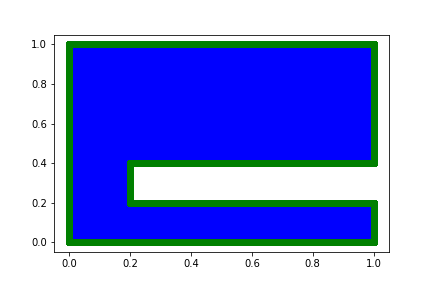
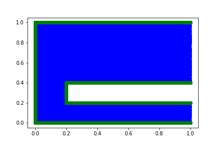
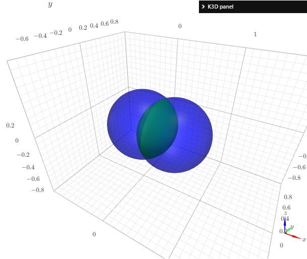
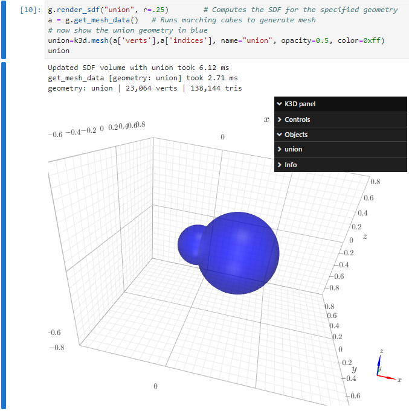

# Chapter 2: Inspecting the Point Cloud
[index](index.md)

Create a new project and put the following in `problem.py`

---
```python
from cfg import *

[x, y], [u] = p.add_neural_network(name="NN", inputs=["x", "y"], outputs=["u"])

r1 = p.Rectangle("r1", (0,0),(1,1))
r2 = p.Rectangle("r2", (0.2,0.2),(1,0.4))

geo = p.GeometryDifference("geo", r1,r2)

interior = p.add_interior_subdomain("interior", geom=geo)
boundary = p.add_boundary_subdomain("boundary", geom=geo)

p.add_constraint("wave_equation", enforce(equation=Eq(u,0), on_domain=interior))
p.add_constraint("BC", enforce(equation=Eq(u,0), on_domain=boundary))
```
---

Then initialize the configuration with `mtc init-conf` and sample the subdomains with `mtc sample`. The files for each of the constraints reside in `training/stage1/samples` and that directory should look like:
```
# ll training/stage1/samples
total 109400
drwxr-xr-x 2 root root     4096 Oct  1 20:00 ./
drwxr-xr-x 4 root root     4096 Oct  1 19:55 ../
-rw-r--r-- 1 root root 40004096 Oct  1 20:00 BC.hdf5
-rw-r--r-- 1 root root 32004096 Oct  1 20:00 wave_equation.hdf5
```

Now create a notebook at the root of the project directory and with kernel type `modulus-python`, and run the following cell:

---
```python
import matplotlib.pyplot as plt
import h5py

with h5py.File("training/stage1/samples/interior.hdf5") as f:
    print(f.keys())  
    plt.plot(f['x'], f['y'], '.')
with h5py.File("training/stage1/samples/boundary.hdf5") as f:
    print(f.keys())
    plt.plot(f['x'], f['y'], 'o')
```
---

The plot should look like this:




Now modify the `boundary` subdomain in the problem definintion by adding the criterion that `x<1` as follows:

---
```python
boundary = p.add_boundary_subdomain("boundary", geom=geo, criteria=x<1)
```
---

And run `mtc sample` followed by a rerun of the cell in the notebook. The resulting figure should remove all boundary (green) points from the right hand side.



Procedure

1. Run `mtc sample` in root project directory (as always) creates HDF5 files inside `training/stage1/samples` for each subdomain.

    Note: `mtc sample --stage stageX` is the command to sample for a specific stage; by default `stage1` will be used if not specified. See `mtc sample --help` for more.


An alternative way to display all sub-domains is this

---
```python
import numpy as np
import matplotlib.pyplot as plt
import h5py, os
dpath = 'training/stage1/samples/'
n=1000 # number of points from each sub-domain
for fname in os.listdir(dpath):
    with h5py.File(dpath+fname) as f:
        idx=np.random.choice(np.arange(f['x'].shape[0]), size=n)
        idx=np.sort(idx)
        plt.plot(f['x'][:][idx], f['y'][:][idx], '.', label=fname)
        
plt.legend()
# plt.legend(ncol=1, loc=2,bbox_to_anchor=(1.0, 1))
```
---

## Working with 3D and the Geometry API

The geometry sub-system of Modulus allows for Constructive Solid Geometry (CSG). MTC exposes that functionality as well and facilitates geometry creation using the Geometry API through the `mtc compile --target geometry`. Here is a simple non-trivial example showing multiple geometries:

1. Create a new project
2. Create a `problem.py` file with the following (note that the radius for `sphere1` is a parameter `r`)
```python
from cfg import *
[x, y, z, r], [u] = p.add_neural_network(name="NN", 
                                         inputs=["x", "y", "z", "r"], 
                                         outputs=["u"])
params = {r:0.5}
sphere1 = p.Sphere("sphere1", (0,0,0), r, params=params)
sphere2 = p.Sphere("sphere2", (0.5,0,0), .5)
union = p.GeometryUnion("union", sphere1, sphere2)
intersection = p.GeometryIntersection("intersection", sphere1, sphere2)
diff = p.GeometryDifference("difference", sphere1, sphere2)
```

3. Then, in a notebook run the following cell
```python
import k3d
p = k3d.plot()
!mtc compile --target geometry

from training.stage1.geometry import Geometry
g = Geometry(200)

g.render_sdf("union")        # Computes the SDF for the specified geometry
a = g.get_mesh_data()   # Runs marching cubes to generate mesh
# now show the union geometry in blue
union=k3d.mesh(a['verts'],a['indices'], name="union", opacity=0.5, color=0xff)

g.render_sdf("intersection") # Computes the SDF for the specified geometry
a = g.get_mesh_data()   # Runs marching cubes to generate mesh
# now show the intersection geometry in green
intersection=k3d.mesh(a['verts'],a['indices'], name = "intersection", opacity=1.0, color=0xff000)

g.render_sdf("difference") # Computes the SDF for the specified geometry
a = g.get_mesh_data()   # Runs marching cubes to generate mesh
# now show the difference geometry in green
difference=k3d.mesh(a['verts'],a['indices'], name = "difference", opacity=1.0, color=0xff0000)

p += union
p += intersection
p += difference
p
```



The Geometry API is provided through the `geometry.py` module compiled from the `problem.py` definition. This make it specific to the project. For example, the SDF rendering calls take the form of `render_sdf(X)` where `X` is the name of the geometry specified in the `problem.py` file (the first argument to a geometry call). In the above example, `X` is any of `sphere1`, `sphere2`, `union`, or `intersection`. The list can be obtained with `g.list_geometries()`. Also, `g.render_sdf()` takes an optional argument `r` to specify the parameter, so `g.render_sdf("sphere1", r=0.25)` will create a smaller sphere than the default in this example. Note that this parameter carries to all geometries.

Here is an example of using `r` to render the `union` geometry. In a new cell run
```python
g.render_sdf("union", r=.25)        # Computes the SDF for the specified geometry
a = g.get_mesh_data()   # Runs marching cubes to generate mesh
# now show the union geometry in blue
union=k3d.mesh(a['verts'],a['indices'], name="union", opacity=0.5, color=0xff)
union
```



The Geometry API also allows for SDF calculations (through `g.sdf(geom_name, xyz: np.array, optional_parameters)`) and for adjusting the mesh vertex points (through `g.adjust_points`). More documentation is forthcoming.

## Tutorial Witer's Notes (TODOs):

1. Give step by step instructions on how to sample a problem with the two kinds of domain (interior and boundary), and then how to plot them

1. Add an exercise to generate a couple of non-trivial 2D/3D geometries and plot the sampled points. E.g., geom like `rect1-rect2-circle`

1. Show that sampling is useful to see what variables are available to the subdomains. In particular, that boundary subdomains and interior subdomains define/compute different additional variables (e.g., `normal_x` ofr bdry and `sdf` for interior)