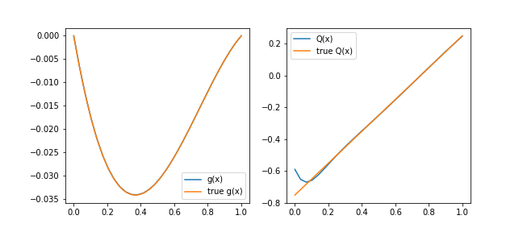
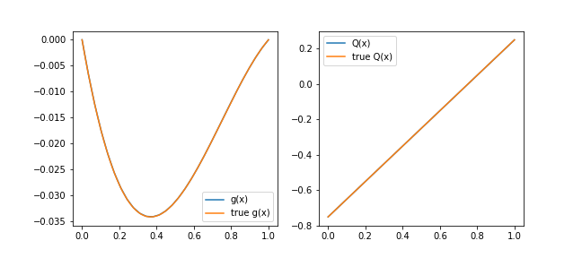
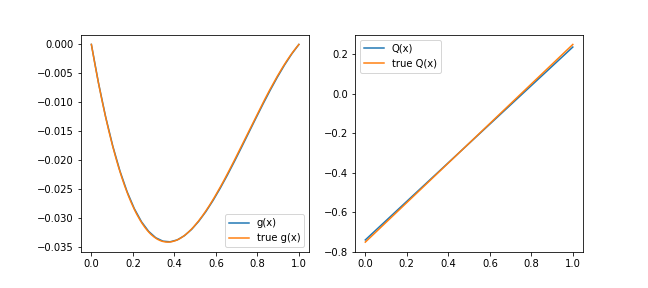

# Chapter 4: Adding Data Constraints
[index](index.md)

In the examples so far the neural networks were trained using problem-defined data: we used a point cloud obtained from the sub-domain (and geometry) definition (these are sometimes called co-location points). In this chapter we will explore the use of externally (field) generated data to constrain a problem.

The way to provide a field data constaint is through `add_data_constraint()`. In fact, the `problem.py` may be as simple as declaring a neural network and adding one such constraint. For example,

---
```python
from cfg import *

[x], [v] = p.add_neural_network(name="uNN", inputs=["x"], outputs=["v"])
hdf_fname=os.path.join(os.getcwd(), 'data.hdf5')
p.add_data_constraint(name="from field", model=v, data_fname=hdf_fname)
```
---

Where the file `data.hdf5` looks like this
```
# mtc hdf5-info data.hdf5 

HDF5 file data.hdf5
keys ['v', 'x']
shape (10, 1)
```

**NOTE:** the HDF5 file passed to `add_data_constraint` must contain entries for each of the variables of the unknown functions (in this case that is only `x`) as well as the desired model to train.

## Inversion

Loading field data is particularly useful to solve inversion problems. For example, suppose we want to find $Q(x)$ using the constraint $T_{xx}(x) + Q(x)=0$ and data for $T(x)$ over $x\in(0,1)$ interval.

We can accomplish this by making both $T(x)$ and $Q(x)$ unknown functions (implemented by neural networks). The data, for our purposes, was generated using our parametrized problem solved in Chapter 3 where the parameter `a=0.75`. It is included here for convenience and may be inspected with the `mtc hdf5-info` tool:
```
# mtc hdf5-info diff-data-a75.hdf5 

HDF5 file diff-data-a75.hdf5
keys ['Q', 'g', 'x']
shape (300, 1)
```

The `problem.py` now looks like this.

---
```python
from cfg import *

[x], [u] = p.add_neural_network(name="uNN", inputs=["x"], outputs=["u"])
[x], [Q] = p.add_neural_network(name="QNN", inputs=["x"], outputs=["Q"])

geom = p.Line1D("geom", 0,1)
interior = p.add_interior_subdomain("interior", geom=geom)

g = p.add_submodel("g", x*(x-1)*u)
diff_eq = Eq(g.diff(x,2) + Q, 0)
p.add_constraint("diffusion", enforce(equation=diff_eq, on_domain=interior))

# data constraint
hdf_fname=os.path.join(os.getcwd(), "diff-data-a75.hdf5")
p.add_data_constraint(name="from field", model=g, data_fname=hdf_fname)
```

**NOTE:** Observe that here the data constraint is applied to the sub-model `g(x)` and not to the neural network `u(x)`.

And the result after running for 1000 steps looks like this


And if we let it run for 20,000 steps (the next chapter will explain how to adjust training parameters like max steps):



But even with 20000 steps we do not get a perfect match. If we know more about what the solution $Q(x)$ should look like, then we can greatly accelerate and improve the result. For example, in this case we know that $Q(x)$ is linear, so we could add an additional constraint (no other changes to `problem.py` are needed)

---
```python
p.add_constraint("Q_is_linear", enforce(equation=Eq(Q.diff(x,2),0),
                                        on_domain=interior))
```
---

Then the result (in just 1000 steps using 300 data points), matches almost perfectly:



Of course, if fewer data points are available from the field, then this type of additional constraint becomes even more important. For example, if only 10 points--as opposed to the 300 above--are available, then we can get a great match in 8000 steps.



These plots were generated by running the following code in a notebook with a `modulus-python` kernel:

---
```python
import numpy as np
import matplotlib.pyplot as plt
import training.stage1.infer as infer1

x = np.linspace(0,1, 30)

f, axs = plt.subplots(1,2, figsize=(9,4))
axs[0].plot(x, infer1.infer(x=x, outputs=["g"])['g'], label=f"g(x)")
axs[1].plot(x, infer1.infer(x=x, outputs=["Q"])['Q'], label=f"Q(x)")

import h5py
with h5py.File("diff-data-a75.hdf5") as f:
    print(f.keys())
    axs[0].plot(f['x'], f['g'], label=f"true g(x)")
    axs[1].plot(f['x'], f['Q'], label=f"true Q(x)")
axs[0].legend()
axs[1].legend()
```
---