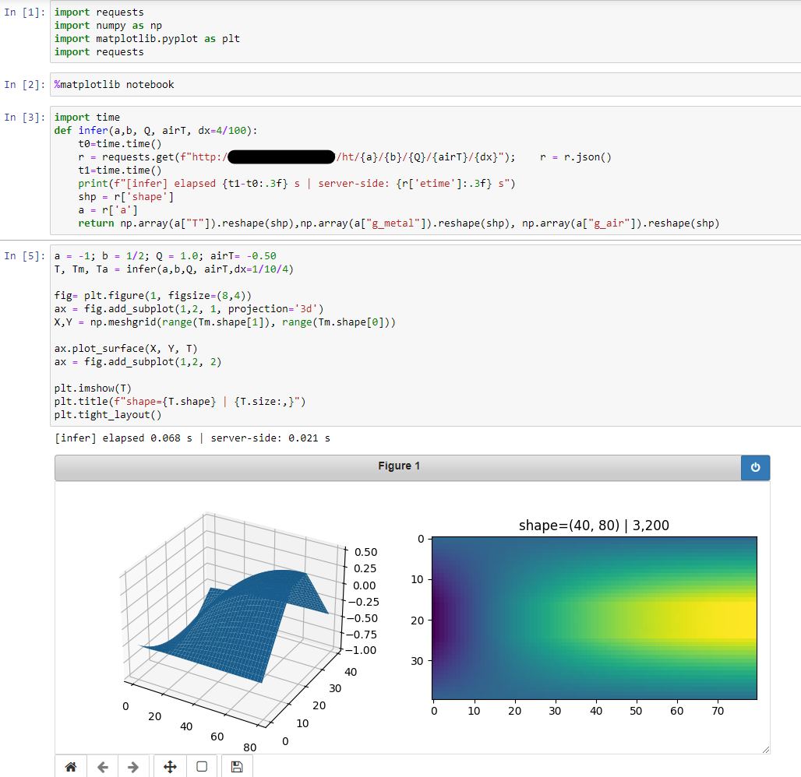

The file [example2.py](example2.py) contains an example of a Heat Equation problem that is parameterized by 3 boundary condition values plus a heat source. There are two media (metal and air) with very different diffusion coefficients. 

Create a test directory by running
```
mkdir test_dir
cp -r conf pointwise_problem.py example2.py rest_server.py test_dir/
cd test_dir
```
To train the model, run the following inside the `test_dir`
```
python -c "from example2 import p; p.train()"
```

This will produce output like the following (using an RTX A6000 GPU)
```
.... snip ....

[04:10:59] - Jit compiling network arch
[04:10:59] - Jit compiling network arch

Neural Networks
--------------------------------------------------------------------------------
|  metalNN = fully_connected(inputs=['x', 'y', 'a', 'b', 'Q', 'airT'], outputs=['u_metal'])
|  airNN = fully_connected(inputs=['x', 'y', 'a', 'b', 'Q', 'airT'], outputs=['u_air'])
-------------------------------------------------------------------------------- 

Models
--------------------------------------------------------------------------------
|  g_metal : a + 0.5*(-a + b)*(x + 1) + (x - 1)*(x + 1)*u_metal + (x - 1)*(x + 1)
|  g_air : airT + y*(y - 1)*u_air
|---
| T = 
|            g_metal  if  (y > 0.4) & (y < 0.6)
|            g_air  if  ~((y > 0.4) & (y < 0.6))
-------------------------------------------------------------------------------- 

Constraints
--------------------------------------------------------------------------------
|  interior_metal : -Q - 1.0*g_metal__x__x - 1.0*g_metal__y__y
|  interior_air : 0.01*g_air__x__x + 0.01*g_air__y__y
|  interface_air_metal_continuity : g_air - g_metal
|  interior_air_metal_flux : 0.01*normal_x*g_air__x - 1.0*normal_x*g_metal__x + 0.01*normal_y*g_air__y - 1.0*normal_y*g_metal__y
-------------------------------------------------------------------------------- 

[04:11:02] - attempting to restore from: /tests/test_dir
[04:11:02] - optimizer checkpoint not found
[04:11:02] - model airNN.pth not found
[04:11:02] - model metalNN.pth not found
[04:11:10] - [step:          0] record constraint batch time:  1.203e+00s
[04:11:10] - [step:          0] saved checkpoint to /tests/test_dir
[04:11:10] - [step:          0] loss:  5.780e+00
[04:11:12] - Attempting cuda graph building, this may take a bit...
[04:11:16] - [step:        100] loss:  1.486e-02, time/iteration:  5.445e+01 ms

... snip ...
```

After about 9000 steps you may stop it and run the REST server
```
python rest_server.py
```

**NOTE** The [example3.py](example3.py) is solving the same problem but using a single Neural Network to define both `u_air` and `u_metal`. Its loss function values is `[step:      18000] loss:  2.778e-04`

[example2.py](example2.py) `[2 NNs] -> [step:      09,000] loss:  1.531e-04`

[example2.py](example2.py) `[2 NNs] -> [step:      18,000] loss:  9.994e-05`

[example3.py](example3.py) `[1 NN ] -> [step:      18,000] loss:  2.778e-04`

Run the following to get information about the problem
```
python -c "from example3 import p; p.pprint()"
```
Should yield
```

Neural Networks
--------------------------------------------------------------------------------
|  metalNN = fully_connected(inputs=[x, y, a, b, Q, airT],
|                            outputs=[u_metal, u_air])
-------------------------------------------------------------------------------- 

Models
--------------------------------------------------------------------------------
|  g_metal : a + 0.5*(-a + b)*(x + 1) + (x - 1)*(x + 1)*u_metal + (x - 1)*(x + 1)
|  g_air : airT + y*(y - 1)*u_air
|---
| T = 
|            g_metal  if  (y > 0.4) & (y < 0.6)
|            g_air  if  ~((y > 0.4) & (y < 0.6))
-------------------------------------------------------------------------------- 

Constraints
--------------------------------------------------------------------------------
|  interior_metal : -Q - 1.0*g_metal__x__x - 1.0*g_metal__y__y
|  interior_air : 0.01*g_air__x__x + 0.01*g_air__y__y
|  interface_air_metal_continuity : g_air - g_metal
|  interior_air_metal_flux : 0.01*normal_x*g_air__x - 1.0*normal_x*g_metal__x + 0.01*normal_y*g_air__y - 1.0*normal_y*g_metal__y
-------------------------------------------------------------------------------- 

```

And the server may be queried from a remote client (inside a Jyputer notebook in this case)



